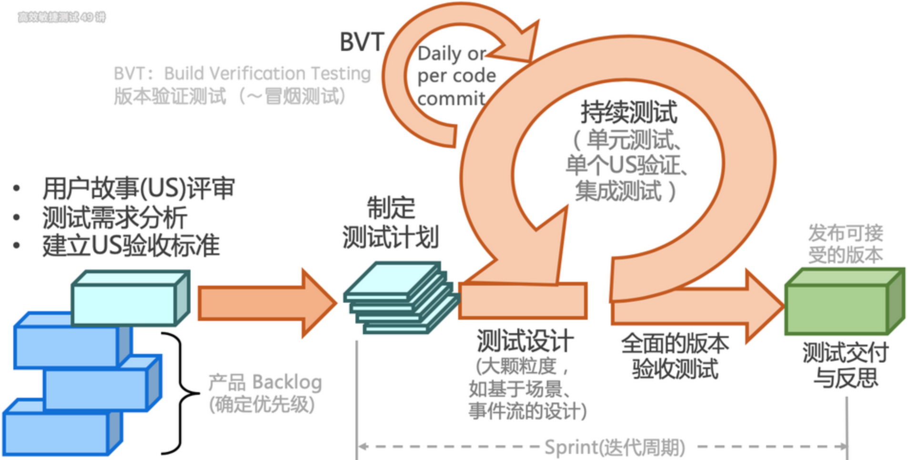

---
tags:
  - 理论
  - 敏捷
---

# 测试流程与敏捷实践

> 来源：`source/_posts/testing-theory.md`  
> 整理日期：2026-6-14  
> 适用场景：团队流程设计、敏捷转型、测试计划制定

---

## 一、传统测试流程

1. **需求分析**：明确测试范围与优先级。
2. **测试计划**：制定目标、策略、风险应对方案。
3. **测试设计**：转化为具体用例（等价类、场景法等）。
4. **测试执行**：执行自测、回归测试、缺陷跟踪。
5. **发布维护**：监控线上问题并修复。

---

## 二、敏捷测试流程

敏捷测试本质是短、频、快地反馈代码提交的质量，促进持续交付。

### 2.1 敏捷测试特点

- **质量内建**：测试左移（参与需求评审） + 测试右移（监控生产环境）。
- **持续测试**：自动化与探索式测试结合，快速反馈代码质量。
- **分层策略**：单元测试 → 接口测试 → UI 测试，平衡效率与覆盖。

### 2.2 敏捷测试中的测试角色

| 阶段 | 测试活动 |
| --- | --- |
| 需求 | 参与评审、识别模糊点、定义验收标准 |
| 开发 | 代码评审、单元测试评审、接口契约验证 |
| 集成 | 接口自动化、持续集成验证 |
| 发布 | 回归测试、发布准出 |
| 运维 | 线上监控、故障复盘、A/B 测试 |

---

## 三、探索式测试（ET）

探索式测试旨在将学习、测试设计、测试执行和测试结果分析做为一个循环快速地迭代，在较短的时间内（如 1 个小时）完成多次循环，以持续优化测试。该思路与敏捷软件开发小步快跑、持续反馈的理念不谋而合。

### 3.1 核心

质疑系统存在漏洞（需求误解、实现错误、性能瓶颈等）。

### 3.2 实施步骤

1. 制定 SMART 目标（具体、可度量、可实现）。
2. 分时间盒（如 50 分钟）执行"设计-执行-分析"循环。
3. 通过测程管理（SBTM）记录测试结果并复盘。

### 3.3 适用场景

- 新功能快速验证
- 复杂业务流程的首次测试
- 自动化覆盖不足的长尾场景
- 发现"意料之外"的问题

---

## 四、实践建议

1. **传统瀑布团队**：适合需求稳定、发布周期长的项目，注意在测试设计阶段充分覆盖非功能性需求。
2. **敏捷团队**：测试人员应尽早介入需求评审，与开发、产品共建质量。
3. **探索式测试制度化**：每周安排固定时间进行 ET，并用 SBTM 记录过程和发现。
4. **自动化与 ET 结合**：核心链路自动化保障回归效率，ET 补充长尾和异常场景。

---

## 五、关联文档

- [[测试思维与设计方法]]
- [[测试工作的核心原则]]
- 3.4 CI/CD 集成