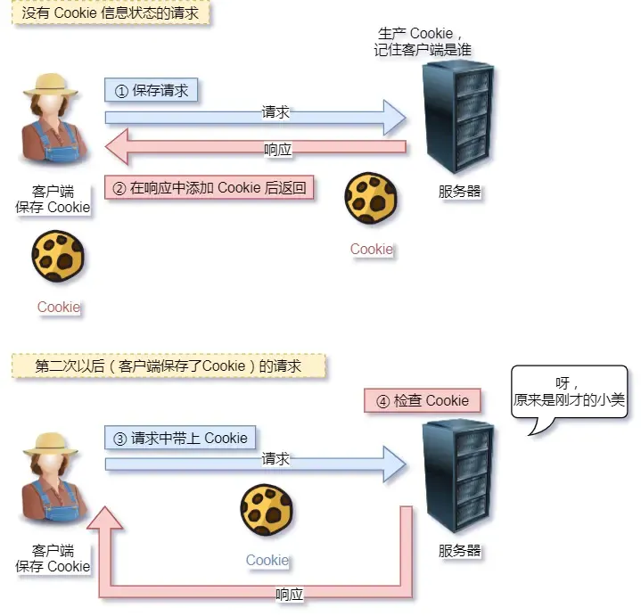
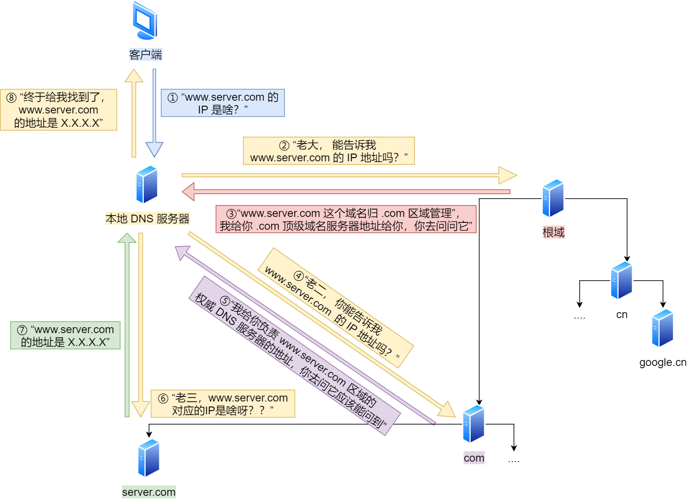

---
tags:
  - 理论
  - 网络
---
# 网络基础知识

## 一、TCP/IP 四层模型

| TCP/IP 层级 | OSI 对应             | 核心功能          | 常用协议                   |
| --------- | ------------------ | ------------- | ---------------------- |
| 应用层       | L5-L7（会话层、表示层、应用层） | 面向用户的应用协议     | HTTP、HTTPS、DNS、SSH、FTP |
| 传输层       | L4                 | 端到端可靠/不可靠传输   | TCP、UDP                |
| 网络层       | L3                 | 寻址与路由         | IP、ICMP、BGP            |
| 链路层       | L1-L2（数据链路层、物理层）   | 物理介质传输、MAC 寻址 | ARP、以太网                |

**测试开发视角**：
- 接口测试主要关注 **应用层** 的请求/响应语义。
- 性能测试需要理解 **传输层** TCP 连接、拥塞控制、端口复用。
- 环境部署排查需要用到 **网络层/链路层** 的 ping、traceroute、ARP。

**数据封装**：发送端逐层向下传输时，每层都会附加对应层的协议头（数据链路层还会附加协议尾），最终形成可在物理介质上传输的比特流；接收端则逐层解封装。

---

## 二、HTTP 协议

### 2.1 基本特性

- **无状态**：服务器不保留客户端请求历史，需借助 Cookie/Session/Token 维持状态。
- **请求-应答模式**：客户端发起请求，服务器返回响应。
- **文本协议**：报文由 Header + Body 组成，易于抓包分析。

### 2.2 常见状态码与测试含义

| 状态码     | 含义      | 测试关注点               |
| ------- | ------- | ------------------- |
| 200     | 成功      | 正常响应断言基准            |
| 201     | 创建成功    | POST 创建资源后验证        |
| 204     | 无内容     | DELETE 或更新操作成功但无返回体 |
| 301/302 | 重定向     | 验证重定向目标、是否循环重定向     |
| 304     | 未修改     | 缓存生效验证              |
| 400     | 请求参数错误  | 参数校验用例核心断言          |
| 401     | 未认证     | 鉴权失败场景              |
| 403     | 无权限     | 权限控制测试              |
| 404     | 资源不存在   | 异常路径测试              |
| 500     | 服务器内部错误 | 服务端异常兜底             |
| 502     | 网关错误    | 反向代理/上游服务异常         |
| 503     | 服务不可用   | 限流、熔断、降级场景          |
| 504     | 网关超时    | 超时配置、慢请求测试          |

### 2.3 状态保持机制

| 机制         | 原理                              | 测试关注点              |
| ---------- | ------------------------------- | ------------------ |
| Cookie     | 服务器通过 `Set-Cookie` 写入客户端，后续请求携带 | XSS/CSRF 安全测试、过期时间 |
| Session    | 状态存服务端，通过 Session ID 关联         | 会话一致性、分布式会话        |
| Token（JWT） | 服务器签发令牌，客户端每次携带                 | 令牌失效、刷新、鉴权范围       |

### 2.4 HTTP 与 HTTPS

| 对比项 | HTTP | HTTPS       |
| --- | ---- | ----------- |
| 安全性 | 明文传输 | SSL/TLS 加密  |
| 端口  | 80   | 443         |
| 性能  | 较低开销 | 增加 TLS 握手开销 |
| 证书  | 不需要  | 需要 CA 证书    |

**测试注意**：HTTPS 测试需关注证书过期、自签名证书信任、TLS 版本兼容性。

---

## 三、WebSocket 协议

| 特性   | HTTP      | WebSocket    |
| ---- | --------- | ------------ |
| 通信方向 | 单向：客户端发起  | 双向：服务器可主动推送  |
| 连接   | 短连接/长连接   | 长连接          |
| 头部开销 | 每次请求带完整头部 | 建立连接后数据帧轻量   |
| 适用   | 请求-响应场景   | 实时通知、IM、行情推送 |

**测试关注点**：
- 连接建立与断开。
- 心跳保活机制。
- 断线重连与消息顺序。
- 并发连接数与资源消耗。

---

## 四、DNS 协议

### 4.1 基本概念

- DNS（Domain Name System，域名系统）负责将人类可读的域名解析为机器可识别的 IP 地址。
- 采用分布式、层次化的数据库设计，由根域名服务器、顶级域服务器、权威域服务器共同协作完成解析。
- 默认使用 **UDP 53** 端口进行普通查询；当响应数据较大或进行区域传输时，使用 **TCP 53** 端口。

### 4.2 常见记录类型

| 记录类型 | 作用 | 测试关注点 |
|---|---|---|
| A | 域名 → IPv4 地址 | 域名是否正确解析到目标服务器 |
| AAAA | 域名 → IPv6 地址 | IPv6 环境下服务可达性 |
| CNAME | 域名别名指向另一个域名 | 链式解析、CDN 加速配置 |
| MX | 邮件交换记录 | 邮件服务配置（非接口测试重点） |
| NS | 指定权威 DNS 服务器 | 域名托管、DNS 切换 |
| TXT | 文本记录，常用于验证 | SPF、DKIM、域名所有权验证 |

### 4.3 解析流程

1. 简单来说，当在浏览器地址栏中输入某个Web服务器的域名时。主机会发出一个DNS请求到**本地DNS服务器**（也就是客户端 TCP/IP 设置中填写的 DNS 服务器地址）。
2. **本地DNS服务器**会首先查询高速缓存记录，如果缓存中有此条记录，就可以直接返回结果。若没有查到，本地DNS则将请求发给根域DNS服务器。
3. 根DNS服务器并不会记录域名和IP地址的对应关系，只会“指路”；即告知**本地DNS**去迭代查找至顶级域、二级域（.com 、.org），三级域，直至找到要解析的IP地址
4. **本地DNS** 再将IP地址返回给客户端，客户端与目标成功建立连接。同时把对应关系保存在缓存中，加快网络访问。

```bash
# 查看 DNS 解析过程
dig +trace www.example.com
nslookup www.example.com
```

**DNS 解析流程示意图**：


---

## 五、TCP 与 UDP

### 5.1 TCP 特点

- 面向连接、可靠传输
- 流量控制、拥塞控制、超时重传
- 适用于 HTTP/HTTPS、SSH、FTP

### 5.2 TCP 三次握手与四次挥手

```text
三次握手：SYN → SYN+ACK → ACK
四次挥手：FIN → ACK → FIN → ACK
```

**测试意义**：
- 大量短连接会导致频繁握手，消耗资源（HTTP Keep-Alive 可复用连接）。
- `TIME_WAIT` 状态过多可能耗尽端口，影响压测。

### 5.3 UDP 特点

- 无连接、不可靠、低延迟，不保证数据包一定能到达。
- 适用于 DNS、视频流、日志采集、SNMP。
- 如需可靠传输，需在应用层自行实现。

### 5.4 选择建议

| 场景          | 推荐协议     |
| ----------- | -------- |
| 接口测试、Web 请求 | TCP/HTTP |
| 实时音视频、游戏    | UDP      |
| 域名解析        | UDP（DNS） |
| 高可靠文件传输     | TCP      |

### 5.5 TCP 端口号

- 端口号用于区分同一台设备上的不同应用进程。
- 常见端口：HTTP 80、HTTPS 443、SSH 22。
- 客户端临时端口由操作系统分配，传输层报文携带端口号，接收方据此识别目标应用。

**测试关注点**：
- 端口冲突会导致服务启动失败或请求被转发到错误服务。
- 压测时需关注 `TIME_WAIT` 状态过多导致临时端口耗尽。

---

## 六、IP 协议

### 6.1 基本特性

- IP 协议工作在网络层，负责将传输层报文封装为 IP 报文，实现跨网络传输。
- 当 IP 报文大小超过 MTU（以太网通常 1500 字节）时，会进行分片传输。

### 6.2 IP 地址与子网

| 概念    | 作用            | 测试关注点                 |
| ----- | ------------- | --------------------- |
| IP 地址 | 标识互联网上的每台设备   | 环境配置、白名单、容器/虚拟机 IP 冲突 |
| 子网    | 缩小寻址范围，提高路由效率 | 同子网/跨子网通信、网络隔离        |
| 子网掩码  | 划分网络位与主机位     | 掩码配置错误导致路由不可达         |

### 6.3 路由

- 路由器根据目标 IP 地址找到对应子网，将数据包转发到正确的网络路径。
- 实际环境中数据包通常经过多个网关、路由器、交换机才能到达目标。

### 6.4 测试开发视角

- 接口测试通常不直接关注 IP 层，但网络不通时需用 `ping`、`traceroute` 区分是路由问题还是服务问题。
- 容器/Kubernetes 环境中，Pod IP、Service IP、Node IP 的寻址和路由直接影响服务可达性。
- 安全测试里，子网隔离和 ACL 是常见的网络边界控制手段。

---

## 七、ARP 协议

### 7.1 基本作用

- ARP（地址解析协议）负责 IP 地址与 MAC 地址之间的映射。
- 每台主机维护 ARP 缓存表，记录 IP 与 MAC 的对应关系，默认生存时间约 20 分钟。

### 7.2 地址解析过程

1. 源主机检查 ARP 缓存中是否存在目标 IP 的 MAC 地址。
2. 若不存在，则在本网段广播 ARP 请求，目的 MAC 为 `ff:ff:ff:ff:ff:ff`。
3. 目标主机收到请求后，将自己的 MAC 地址单播返回给源主机。
4. 源主机更新 ARP 缓存，后续通信直接发送数据帧。
![[Pasted image 20260705105357.png]]

### 7.3 测试开发视角

- 同一子网内通信异常，可能是 ARP 缓存错误或 ARP 欺骗导致。
- 跨子网通信不依赖 ARP，需检查路由和网关配置。
- 容器/虚拟化环境中，ARP 表项异常可能导致同网段主机不可达。

---

## 八、网络设备与 VLAN

### 8.1 常见网络设备

| 设备    | 工作层级 | 核心功能                           |
| ----- | ---- | ------------------------------ |
| 集线器   | L1   | 广播数据包到所有端口，无智能过滤               |
| 交换机   | L2   | 基于 MAC 地址转发数据帧，支持 VLAN 划分      |
| 路由器   | L3   | 基于 IP 地址路由数据包，隔离广播域，支持 NAT、防火墙 |
| 三层交换机 | L3   | 结合交换机与路由器功能，高速转发并支持路由策略        |

### 8.2 交换机工作原理

- 交换机根据每个**端口**接收到的数据帧源地址学习源 MAC 地址，内部维护 MAC 地址表。在后续的通讯中，发往特定MAC地址的数据包仅被转发至该MAC地址对应的端口，而非所有端口。
- 数据帧转发：
  - 找到目的 MAC → 直接转发到对应端口。
  - 未找到目的 MAC → 泛洪到所有端口（除接收端口）。
- 三层交换机可处理网络层协议，首次路由后通过二层 MAC 地址表快速转发。

### 8.3 VLAN

- VLAN（虚拟局域网）将一个物理 LAN 在逻辑上划分为多个广播域。每个VLAN网络是一个独立的广播域，VLAN内的设备可以相互通信，而不同VLAN之间的设备默认不能直接通信，必须通过三层设备（如路由器或三层交换机）进行路由才能互通。
- 优点：限制广播域、增强安全性、提高网络健壮性、灵活构建虚拟工作组。
- VLAN Tag（IEEE 802.1Q）：以太网帧中加入 4 字节标签，标识所属 VLAN。
- 常见接口类型：
  - **Access**：连接终端，通常收发无 Tag 帧，属于单一 VLAN。
  - **Trunk**：连接交换机/路由器，允许多个 VLAN 带 Tag 通过。
  - **Hybrid**：兼具 Access 和 Trunk 特性，可灵活配置哪些 VLAN 带 Tag。
- 划分VLAN的方法有多种，常见的包括：
	- **基于端口划分（常用）**：将交换机的端口分配到不同的VLAN中。例如，将端口1和2分配到VLAN10，端口3和4分配到VLAN20。
	- **基于MAC地址划分**：根据设备的MAC地址将设备分配到不同的VLAN中。
	- **基于IP子网划分**：根据设备的IP地址和子网掩码来划分VLAN。
	- **基于协议划分**：根据设备使用的协议类型来划分VLAN。

### 8.4 网卡 Bond

- Bond 将多个物理网卡绑定为一个逻辑网卡，共享同一个 IP。
- 常用模式：
  - **mode=0**：平衡负载，双网卡同时工作，需交换机支持链路聚合。
  - **mode=1**：主备模式，主网卡故障时自动切换到备用网卡。
  - **mode=6**：平衡负载，双网卡同时工作，无需交换机支持。
- 测试关注点：高可用切换、带宽聚合、Bond 模式与交换机配置匹配。

---

## 九、网络排查工具与场景

### 9.1 连通性

```bash
ping 8.8.8.8              # 基础连通性
traceroute www.example.com # 路由路径
```

### 9.2 DNS 排查

```bash
nslookup www.example.com
dig www.example.com
```

### 9.3 端口与服务

```bash
ss -tlnp                  # 查看监听端口
curl -v http://localhost:8080/health  # 详细请求响应
```

### 9.4 抓包分析

```bash
# 抓取 8080 端口流量
tcpdump -i eth0 -w capture.pcap port 8080

# 仅抓取 HTTP 请求
tcpdump -i eth0 -A port 80 | grep GET
```

**测试应用**：
- 定位接口超时是网络层还是应用层问题。
- 验证请求参数是否正确发送。
- 分析重试、连接复用行为。

---

## 十、常见问题

### 10.1 怎么解决 HTTP 请求无状态带来的问题

#### 1. Cookie 机制

- **原理**：服务器通过响应头的 `Set-Cookie` 字段向客户端写入键值对数据，客户端后续请求时携带这些 Cookie，从而使服务器能够识别并跟踪用户会话。
- **局限**：
  - 数据存储在客户端，存在安全风险（如 XSS 攻击窃取 Cookie）。
  - 单个域名下 Cookie 大小受限（通常 4KB），且每次请求均会携带，可能影响性能。



#### 2. Session 机制

- **原理**：服务器创建唯一 Session ID 并将其发送给客户端（通常通过 Cookie 传递），并将用户状态存储在服务端（如内存、数据库）。在后续的请求中，客户端会携带 Session ID，服务器根据 Session ID 在服务器端检索对应的会话状态。
- **优势**：状态数据存储在服务端，安全性较高，适合保存敏感信息（如用户权限）。
- **局限**：
  - 服务器需维护 Session 存储（比如会话同步），高并发场景下可能产生性能瓶颈，且在分布式系统中会限制负载均衡的能力。
  - Session ID 依赖 Cookie 传递，若客户端禁用 Cookie 则需通过 URL 重写实现。


#### 3. Token 机制

- **原理**：服务器生成包含用户信息的令牌（如 JWT），客户端在请求头（如 `Authorization`）中携带该令牌。客户端每次请求时携带该 Token，服务器验证后获取用户信息，服务器无需存储会话数据。
- **优势**：
  - 无状态设计减轻服务器压力，适合分布式系统。
  - 支持跨域场景和多种客户端（如移动端 App）。
- **局限**：令牌需定期更新以防止泄露，且需处理令牌吊销问题。

#### 4. 其他优化技术

- **持久连接（Keep-Alive）**：HTTP/1.1 默认启用，通过复用 TCP 连接减少握手开销，间接提升状态相关请求的效率（虽不直接解决无状态问题）。
- **缓存机制**：利用强制缓存（如 `Cache-Control`）和协商缓存（如 `ETag`）减少重复数据传输，缓解无状态导致的冗余问题。

### 10.2 从输入 URL 到页面展示到底发生了什么？

1. 在浏览器中输入指定网页的 URL。
2. 浏览器通过 DNS 协议，获取域名对应的 IP 地址。
3. 浏览器根据 IP 地址和端口号，向目标服务器发起一个 TCP 连接请求（创建套接字 Socket）。
4. 浏览器在 TCP 连接上，向服务器发送一个 HTTP 请求报文，请求获取网页的内容。
5. 服务器收到 HTTP 请求报文后，处理请求，并返回 HTTP 响应报文给浏览器。
6. 浏览器收到 HTTP 响应报文后，解析响应体中的 HTML 代码，渲染网页的结构和样式，同时根据 HTML 中的其他资源的 URL（如图片、CSS、JS 等），再次发起 HTTP 请求，获取这些资源的内容，直到网页完全加载显示。
7. 浏览器在不需要和服务器通信时，可以主动关闭 TCP 连接，或者等待服务器的关闭请求。



### 10.3 TCP 连接是怎么建立和断开的

建立一个 TCP 连接需要“三次握手”，缺一不可：

- **一次握手**：客户端发送带有 SYN（SEQ=x）标志的数据包 -> 服务端，然后客户端进入 **SYN_SEND** 状态，等待服务端的确认；
- **二次握手**：服务端发送带有 SYN+ACK（SEQ=y，ACK=x+1）标志的数据包 -> 客户端，然后服务端进入 **SYN_RECV** 状态；
- **三次握手**：客户端发送带有 ACK（ACK=y+1）标志的数据包 -> 服务端，然后客户端和服务端都进入 **ESTABLISHED** 状态，完成 TCP 三次握手。

断开一个 TCP 连接则需要“四次挥手”，缺一不可：

1. **第一次挥手**：客户端发送一个 FIN（SEQ=x）标志的数据包 -> 服务端，用来关闭客户端到服务端的数据传送。然后客户端进入 **FIN-WAIT-1** 状态。
2. **第二次挥手**：服务端收到这个 FIN（SEQ=X）标志的数据包，它发送一个 ACK（ACK=x+1）标志的数据包 -> 客户端。然后服务端进入 **CLOSE-WAIT** 状态，客户端进入 **FIN-WAIT-2** 状态。
3. **第三次挥手**：服务端发送一个 FIN（SEQ=y）标志的数据包 -> 客户端，请求关闭连接，然后服务端进入 **LAST-ACK** 状态。
4. **第四次挥手**：客户端发送 ACK（ACK=y+1）标志的数据包 -> 服务端，然后客户端进入 **TIME-WAIT** 状态，服务端在收到 ACK（ACK=y+1）标志的数据包后进入 CLOSE 状态。此时如果客户端等待 **2MSL** 后依然没有收到回复，就证明服务端已正常关闭，随后客户端也可以关闭连接了。

### 10.4 不同网段如何实现通信

不同网段的设备需要通过 **路由设备** 实现通信，具体流程如下：

1. 主机A（192.168.1.10）向主机B（192.168.2.20）发送数据包：
   - 主机A发现目标IP不在同一网段，因此将数据包的目标MAC地址设为 **默认网关**（如 L3 交换机的 IP 192.168.1.1）。
2. 三层交换机接收数据包：
   - 根据目标 IP 192.168.2.20 查询路由表，找到下一跳接口（如连接 192.168.2.0 网段的端口）。
   - 发送 **ARP 请求** 到目标网段，获取主机B的MAC地址。
3. 转发数据包：
   - L3 交换机将数据包的目标 MAC 改为主机B的 MAC，源 MAC 改为自己的接口 MAC，然后通过二层转发到目标网段。
4. 后续通信优化：
   - 三层交换机会缓存 IP-MAC 映射和路由路径，后续数据包直接通过二层转发，无需重复路由。

### 10.5 路由器和交换机区别

**（一）工作层级**：交换机工作在数据链路层（第二层），基于 MAC 地址进行局域网内的数据转发；路由器工作在网络层（第三层），通过 IP 地址和路由表实现不同网络间的数据路由和转发。

**（二）数据传输范围**：交换机仅在局域网内进行数据转发；路由器可以连接局域网、广域网和互联网，实现跨网络的数据传输。

**（三）转发方式**：交换机使用 MAC 地址学习和转发表进行数据包的转发；路由器根据 IP 地址和路由表选择最佳路径和下一跳地址，进行数据包转发。

**（四）安全性**：交换机提供基本的网络隔离和广播域控制；路由器具备高级安全功能，如 ACL、防火墙和 VPN，提供更强的网络安全保护。

---
