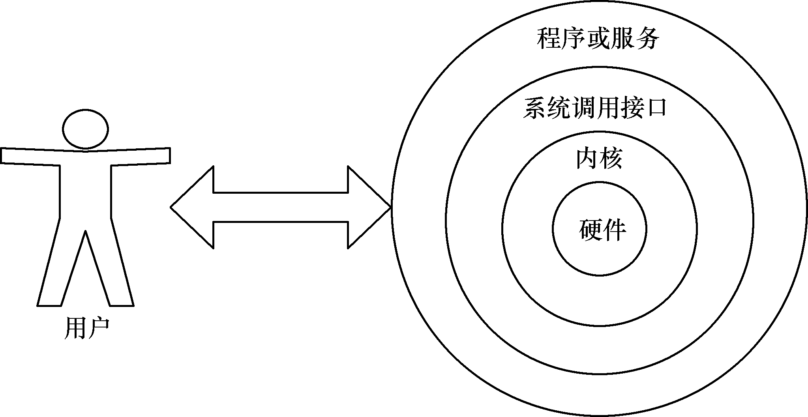
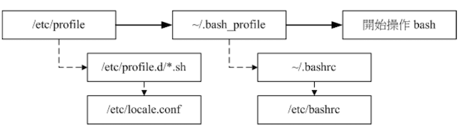

# Shell 脚本编程

> Shell 是用户与 Linux 内核之间的命令行翻译层。测试开发中常用于测试环境预检与初始化、批量执行用例、日志备份与清理、CI/CD Pipeline 前置/后置任务。本文整理 Bash Shell 的核心语法、变量、重定向、判断式和脚本执行方式差异。

## 一、Bash Shell 功能

主流 Linux 系统选择 Bash（Bourne-Again SHell）作为默认的 Shell，主要有以下 4 项优势：

**1. 命令记忆功能**

- 通过上下方向键调取过往执行过的 Linux 命令。
- `~/.bash_history` 记录的是前一次登陆以前所执行过的指令；本次登陆执行的指令暂存在内存中，成功登出后才会写入 `.bash_history`。

**2. Tab 键自动补全命令或文件**

**3. 命令别名设置功能（alias）**

**4. 程序化脚本（shell scripts）**



## 二、Shell 变量

### 2.1 变量的设置规则

1. 变量名由字母、数字、下划线组成，不能以数字开头。变量名一般习惯用大写。
2. 等号两侧不能有空格。
3. 变量值若有空白字符，可使用双引号或单引号将变量内容结合起来：
   - 双引号内的特殊字符如 `$` 等，可以保有原本的特性。
   - 单引号内的特殊字符则仅为一般字符（纯文本）。
4. 反斜杠 `\` 可以将后面的特殊符号（如 `[Enter]`、`$`、`\`、空白字符、`'` 等）变成一般字符串。
5. 反引号 `` ` ` `` 或 `$()` 可以将其中的命令执行后返回结果。
6. 若该变量需要在其他子程序执行，则需要以 `export` 来使变量变成环境变量，例如 `export PATH`。

### 2.2 变量基本操作

1. 查看所有环境变量：`env`
2. 查看单个变量：`echo $PATH`、`echo ${HOME}`
3. 定义变量：`变量名=变量值`
4. 删除变量：`unset 变量名`
5. 特殊符号变量：
   - `$$`：当前进程的 PID 进程号。
   - `$?`：上个命令执行的回传值，0 为执行成功，非 0 执行失败。
   - `$0`：脚本文件名称。
   - `$#`：脚本的参数个数。
   - `$@`：代表 `"$1" "$2" "$3" "$4"` 的意思，每个变量是独立的（用双引号括起来）。
   - `$1` ~ `$9`：位置参数，用于接收环境名、版本号等输入。

| 变量 | 含义 | 测试场景 |
| --- | --- | --- |
| `$0` | 脚本名 | 记录执行入口 |
| `$1` ~ `$9` | 位置参数 | 接收环境名、版本号等参数 |
| `$#` | 参数个数 | 校验必填参数 |
| `$@` | 所有参数（独立引用） | 遍历参数 |
| `$?` | 上条命令退出码 | 判断命令是否成功 |
| `$$` | 当前脚本 PID | 写锁文件或日志 |

```bash
# 示例1：使用反斜杠（\）进行转义
[root@linuxprobe ~]# PRICE=5
[root@linuxprobe ~]# echo "Price is \$$PRICE"
Price is $5

# 示例2：将一个命令的执行结果赋值给变量（重点）
[root@node-1 ~]# A=`date`
[root@node-1 ~]# echo $A
2021年 12月 14日 星期二 01:22:02 CST

[root@node-1 ~]# A=$(date)
[root@node-1 ~]# echo $A
2021年 12月 14日 星期二 01:25:22 CST

# 示例3：单引号和双引号的使用区别
[root@node-1 ~]# NAME='liao xiaobo'
[root@node-1 ~]# NAME="My name is $NAME"  # 双引号会保留特殊符号的含义
[root@node-1 ~]# echo $NAME
My name is liao xiaobo

[root@node-1 ~]# NAME2='My name is $NAME'  # 单引号之间的内容原封不动指定给变量
[root@node-1 ~]# echo $NAME2
My name is $NAME
```

## 三、Bash 的环境配置文件

bash 配置文件的读入方式是通过 `source` 指令来读取的。

整个 login shell 的读取流程如下：



- `/etc/profile`：系统整体的设置，一般不需要修改这个文件。
- `~/.bash_profile` 或 `~/.bash_login`：属于登陆用户的个人设置。

## 四、输入输出重定向

简而言之，输入重定向是指把文件导入到命令中，而输出重定向则是指把原本要输出到屏幕的数据信息写入到指定文件中。

相较于输入重定向，输出重定向的使用频率更高。输出重定向分为标准输出重定向和错误输出重定向两种不同的技术，以及清空写入与追加写入两种模式。

### 4.1 输入重定向

| 符号 | 作用 |
| --- | --- |
| `命令 < 文件` | 将文件作为命令的标准输入 |
| `命令 << 分界符` | 从标准输入中读入，直到遇见分界符才停止 |
| `命令 < 文件1 > 文件2` | 将文件1作为命令的标准输入并将标准输出到文件2 |

```sh
# 远程执行本地 shell 脚本
ssh master02 'bash -s' < /opt/kill.sh

# 等同于 cat admin-openrc.sh | wc -l 的管道符命令组合
[root@master01 ~]# wc -l < admin-openrc.sh
11
```

### 4.2 输出重定向

| 符号 | 作用 |
| --- | --- |
| `命令 > 文件` | 将标准输出重定向到一个文件中（清空） |
| `命令 2> 文件` | 将错误输出重定向到一个文件中（清空） |
| `命令 >> 文件` | 将标准输出重定向到一个文件中（追加） |
| `命令 2>> 文件` | 将错误输出重定向到一个文件中（追加） |
| `命令 >> 文件 2>&1` 或 `命令 &>> 文件` | 将标准输出与错误输出共同写入到文件中（追加） |

## 五、常用判断式

### 5.1 文件判断（类型、权限）

| 测试标志 | 含义 |
| :------: | :--- |
| `-e` | 文件是否存在；**常用** |
| `-f` | 该文件是否存在且为文件（file）；**常用** |
| `-d` | 该文件是否存在且为目录（directory）；**常用** |
| `-b` | 该文件是否存在且为一个 block device |
| `-r` | 该文件是否存在且具有可读权限 |
| `-w` | 该文件是否存在且具有可写权限 |
| `-x` | 该文件是否存在且具有可执行权限 |
| `-ef` | 判断 file1 与 file2 是否是同一文件，可用在判断 hard link 上，主要意义在判定两个文件是否均指向同一个 inode |

### 5.2 整数比较

整数比较运算符仅是对数字的操作，不能将数字与字符串、文件等内容一起操作，也不能想当然地使用日常生活中的等号、大于号、小于号等来判断。

| 测试标志 | 含义 |
| :------: | :--- |
| `-eq` | 两数值相等（equal） |
| `-ne` | 不相等（not equal） |
| `-gt` | 大于（greater than） |
| `-lt` | 小于（less than） |
| `-ge` | 大于等于（greater than or equal） |
| `-le` | 小于等于（less than or equal） |

### 5.3 字符串比较

| 测试标志 | 含义 |
| :------: | :--- |
| `-z string` | 判定字符串是否为 0，若为空串则为 true |
| `-n string` | 判定字符串是否不为 0，若为空串则为 false；`-n` 可省略 |
| `str1 == str2` | 是否相等，相等则为 true |
| `str1 != str2` | 是否不相等，相等则为 false |

### 5.4 逻辑判断

| 测试标志 | 含义 |
| :------: | :--- |
| `-a` | （and）两状况同时成立；如 `test -r filename -a -x filename`，则 file 同时具有 r 与 x 权限时才为 true |
| `-o` | （or）任意一个成立；如 `test -r filename -o -x filename`，则 file 具有 r 或 x 权限时就为 true |
| `!` | 反向状态 |

## 六、脚本执行方式差异

**`./script` 或者 `sh script` 执行**：运行脚本时都会使用一个新的 bash 环境，即子程序的 bash 内执行。当子程序完成后，子程序内的各项变量或动作将会结束，不会传回到父程序中。

```bash
# 运行上面范例的姓名打印
[mrcode@study bin]$ ./showname.sh
Please input you first name: m
Please input you last name: q

 Your full name is: mq
[mrcode@study bin]$ echo ${firstname}${lastname}

```

**`source` 执行**：同样的测试代码，使用 `source` 则会在父程序中执行。

```sh
[mrcode@study bin]$ source showname.sh
Please input you first name: m
Please input you last name: q

 Your full name is: mq
[mrcode@study bin]$ echo ${firstname}${lastname}
mq
```

## 七、脚本练习

### 7.1 利用 date 进行文件的建立

```sh
#!/bin/bash
# Program:
#       用户输入文件名前缀，生成前天、昨天、今天的三个空文件

echo -e "将使用 'touch' 命令创建 3 个文件"
read -p "请输入文件名：" fileuser

# 容错，使用变量功能判定与赋值默认值
filename=${fileuser:-"filename"}

# date 命令的使用
date1=$(date --date='2 days ago' +%Y-%m-%d)  # 两天前的日期，并格式化显示
date2=$(date --date='1 days ago' +%Y-%m-%d)
date3=$(date +%Y-%m-%d)

file1="${filename}_${date1}"
file2="${filename}_${date2}"
file3="${filename}_${date3}"

# 在这里其实可以直接拼接文件名
touch "${file1}"
touch "${file2}"
touch "${file3}"
```

### 7.2 数值运算：简单的加减乘除

在 Linux 变量中，需要使用 `declare` 来定义变量为整数才能进行计算，此外，也可以利用 `$((计算表达式))` 来进行数值运算。bash shell 预设仅支持整数数据。

```sh
#!/bin/bash
# Program:
#       用户输入 2 个整数，输出相乘后的结果
read -p '请输入第一个整数：' intUser1
read -p '请输入第二个整数：' intUser2
declare -i int1=${intUser1}
declare -i int2=${intUser2}

echo -e "\n ${int1} x ${int2} = $((int1*int2))"
```

### 7.3 多重、复杂条件判断

```sh
#!/bin/bash
# Program:
#       直接携带参数提示

if [ "$1" == "hello" ]; then
    echo "Hello, how are you?"
elif [ -z "$1" ]; then
    echo "请携带参数"
else
    echo "只能携带参数 hello"
fi
```

### 7.4 利用 `case...esac` 判断

```sh
#!/bin/bash
# Program:
#       直接携带参数提示

case $1 in
    "hello")
        echo "Hello, how are you?"
    ;;
    "")
        echo "请携带参数"
    ;;
    *)
        echo "只能携带参数 hello"
    ;;
esac
```

