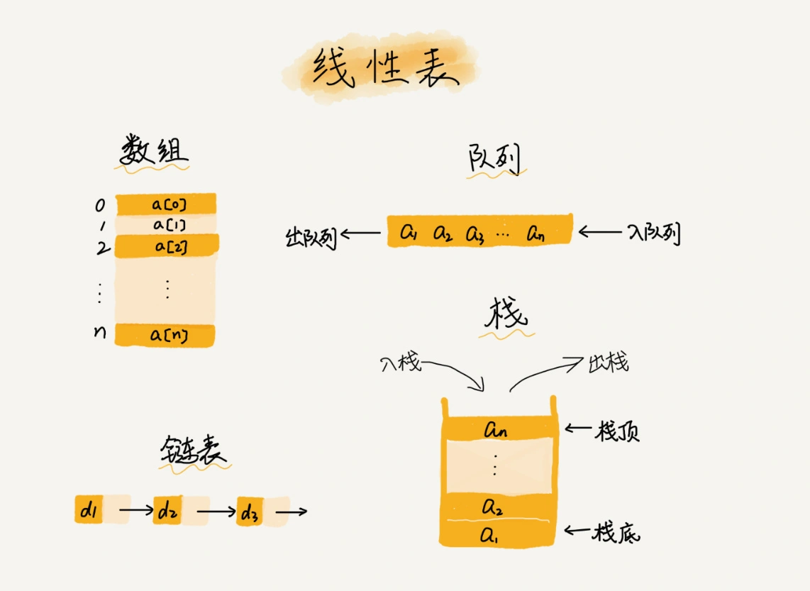
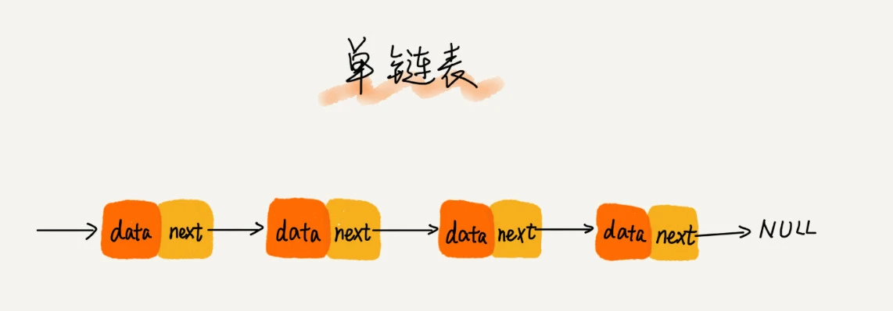
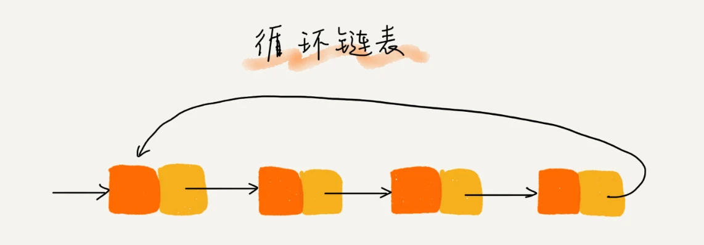
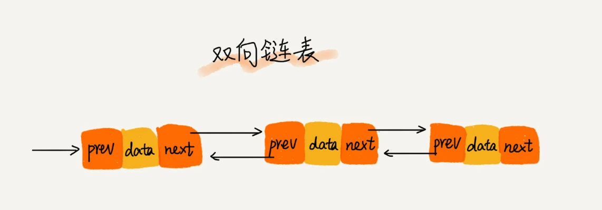
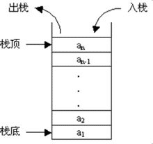
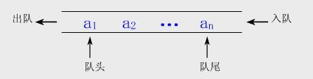
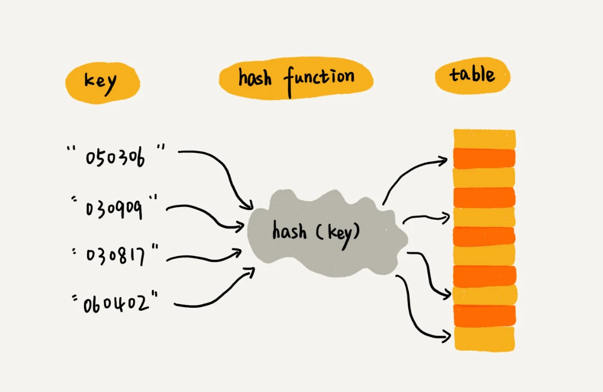
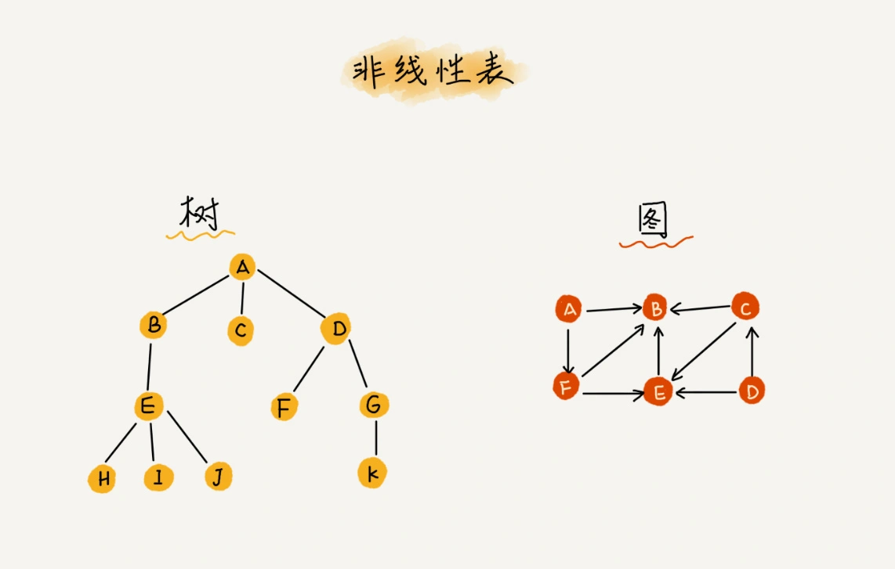

# 常用数据结构

> 整理测试开发中常用的数据结构，包括线性表（数组、链表、栈、队列）、散列表以及非线性表（树、图）的基本概念与特性。

## 一、线性表

### 1.1 数组

数组（Array）是一种线性表数据结构。它用一组连续的内存空间，来存储一组具有相同类型的数据。

连续内存空间保证了数组的“随机访问”特性，根据下标随机访问数组中元素的时间复杂度为 O(1)；同样为了保证内存空间的连续，插入与删除元素会导致大量元素被迫移动，比较低效，最好、最坏、平均时间复杂度分别为 O(1)、O(n)、O(n)。

### 1.2 链表

链表是一种数据元素按照链式存储结构进行存储的数据结构，这种存储结构在物理内存上是非连续的。

链表中的每一个节点必须包括两个部分：一是存储数据元素的数据域，一是存储下一个节点地址的指针域。

#### 单链表

- 头结点用来记录链表的基地址。有了它，就可以遍历得到整条链表。
- 尾节点的后继指针 `next` 指向的不再是下一个节点，而是指向一个空地址 `null`。
- 由于不必按照顺序存储，链表插入和删除元素的时间复杂度 O(1)，查找元素的时间复杂度 O(n)。

#### 循环链表

- 循环链表与单链表的唯一区别在于尾节点，即循环链表的尾节点里面存储下一个节点的内存地址为链表头节点的内存地址。
- 循环链表的优点是从链尾到链头比较方便。当要处理的数据具有环型结构特点时，就特别适合采用循环链表。

#### 双向链表

- 双向链表支持两个方向，每个结点不止有一个后继指针 `next` 指向后面的结点，还有一个前驱指针 `prev` 指向前面的结点。
- 虽然两个指针比较浪费存储空间，但可以支持双向遍历，这样也带来了双向链表操作的灵活性。
- 从结构上来看，双向链表可以支持 O(1) 时间复杂度的情况下找到前驱结点，不需要像单链表那样遍历后进行插入、删除操作。
- 对于一个有序链表，双向链表的按值查询的效率也要比单链表高一些。因为可以记录上次查找的位置 `p`，每次查询时，根据要查找的值与 `p` 的大小关系，决定是往前还是往后查找，所以平均只需要查找一半的数据。

### 1.3 栈

栈是一种后进先出的线性表（LIFO：Last In First Out），它只允许在表尾部进行插入和删除操作。

- 用数组实现的栈，叫作顺序栈；用链表实现的栈，叫作链式栈。
- 不管是顺序栈还是链式栈，入栈、出栈只涉及栈顶个别数据的操作，所以时间复杂度都是 O(1)。

### 1.4 队列

队列是一种先进先出的线性表（FIFO：First In First Out），它只允许在表的前端进行删除操作，在表的后端进行插入操作。

- 数组实现的队列叫做顺序队列，链表实现的队列叫做链式队列。
- 和数组的删除相似，队列操作会导致数据不连续，不连续就会浪费空间，而数据搬移就可以轻松地解决该问题；但在队列中没有必要每次删除都进行数据的搬移，只需要在队列无法继续添加数据时进行一次整体搬移。这种实现思路中，出队和入队操作的时间复杂度仍然是 O(1)。

## 二、散列表

散列表（也称哈希表）用的是数组支持按照下标随机访问数据的特性，所以散列表其实就是数组的一种扩展。

### 2.1 散列函数

**散列函数的作用**：将键（Key）转换为一个固定长度的整数（哈希值），再通过取模运算确定存储位置（索引）。

**注意**：取模运算的核心作用是将任意范围（大小）的哈希值压缩映射到哈希表数组的有效索引范围内，避免越界，并且尽可能均匀分布键值对，减少冲突概率。

**数据存储过程**：

1. 将键（key）通过散列函数（如 `hash(key)`）计算得出一个固定长度的哈希值。
2. 通过取模运算（如 `index = hash(key) % array_length`）将哈希值压缩为数组的有效索引（即下标）。
3. 若索引位置为空，直接存储键值对；若存在冲突（已有键值对），则通过链表、探测等方法将键值对存入其他位置。

**数据查询过程**：

1. 通过相同散列函数计算索引（对应存储过程步骤 1 和 2）。
2. 根据冲突解决策略（如链表遍历或探测）找到目标键，若存在则返回值，否则返回未找到。

### 2.2 冲突解决

不同键映射到同一索引，称为哈希冲突。即 `hash(key1) = hash(key2)`。

解决方法：

- **开放寻址法**（Python 的字典采用）：通过探测（如线性探测、伪随机探测）寻找下一个空闲槽位。
- **链地址法**：将冲突的键值对存储在链表中（如 Java 的 HashMap 早期版本）。

### 2.3 动态扩容

- **触发条件**：当字典的负载因子（元素数量 / 哈希表容量）超过阈值（默认约 2/3）时，自动扩容。
- **扩容机制**：新容量通常是原容量的 2-4 倍，所有元素需要重新哈希并重新分配位置。

## 三、非线性表

### 3.1 树（二叉树）

（待补充具体内容）

### 3.2 图

（待补充具体内容）

