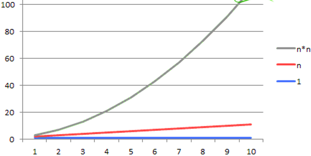
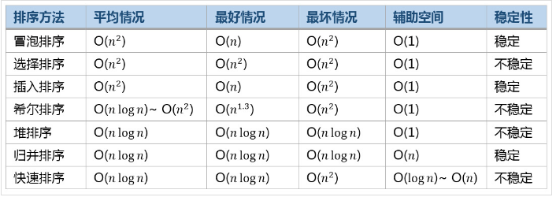
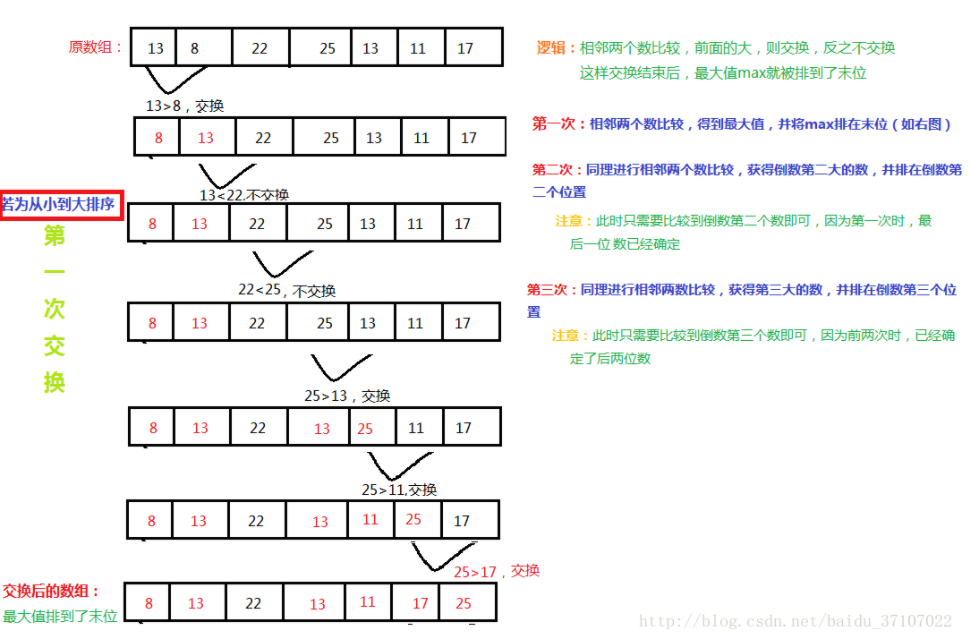
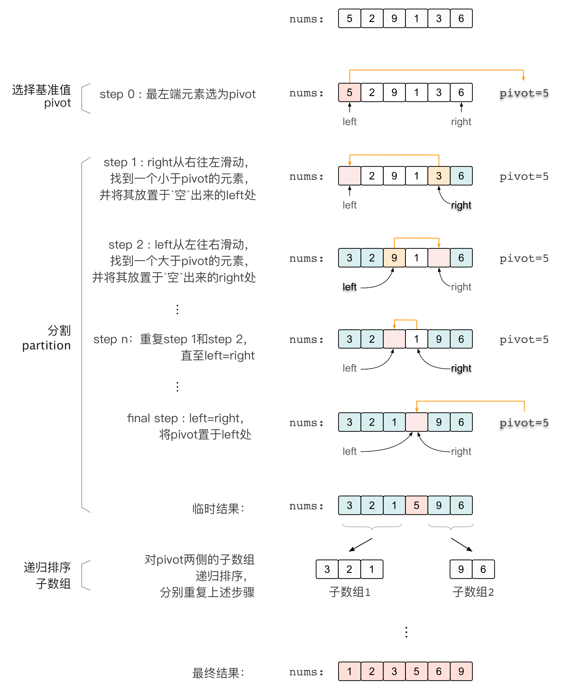

# 算法基础

> 整理算法效率评估方法与常见排序算法，包括时间复杂度、空间复杂度以及冒泡、插入、选择、快速、归并排序的实现思路。

## 一、复杂度分析

### 1.1 算法效率的度量方法

**事后统计方法**

这种方法主要是通过设计好的测试程序和数据，利用计算机计时器对不同算法编制的程序的运行时间进行比较，从而确定算法效率的高低。

**事前分析估算方法**

在计算机程序编写前，依据统计方法对算法进行估算。一个高级语言编写的程序在计算机上运行时所消耗的时间取决于下列因素：

1. 算法采用的策略、方案。
2. 编译产生的代码质量。
3. 问题的输入规模（所谓的问题输入规模是指输入量的多少）。
4. 机器执行指令的速度。

由此可见，抛开与计算机硬件、软件有关的因素，一个程序的运行时间依赖于算法的好坏和问题的输入规模。

### 1.2 实现：1+2+…+99+100

**第一种算法**：

```c
int i, sum = 0, n = 100;   // 执行1次
for( i=1; i <= n; i++ )    // 执行了n+1次
{
    sum = sum + i;          // 执行n次
}
```

**第二种算法**：

```c
int sum = 0, n = 100;     // 执行1次
sum = (1+n)*n/2;          // 执行1次
```

第一种算法执行了 `1+(n+1)+n = 2n+2` 次。第二种算法是 `1+1=2` 次。

当 n 很大时，可以把它想象成 10000、100000。而公式中的低阶、常量、系数三部分并不左右增长趋势，所以都可以忽略。只需要记录一个最大量级就可以了，那么这两个算法其实就是 n 和 1 的差距。



### 1.3 算法时间复杂度

在进行算法分析时，语句总的执行次数 T(n) 是关于问题规模 n 的函数，进而分析 T(n) 随 n 的变化情况并确定 T(n) 的数量级。

算法的时间复杂度，记作：T(n) = O(f(n))。它表示随问题规模 n 的增大，算法执行时间的增长率和 f(n) 的增长率相同，称作算法的渐近时间复杂度，简称为时间复杂度。其中 f(n) 是问题规模 n 的某个函数。用大写 O() 来体现算法时间复杂度的记法，我们称之为**大 O 记法**。一般情况下，随着输入规模 n 的增大，T(n) 增长最慢的算法为最优算法。

- 总的时间复杂度就等于量级最大的那段代码的时间复杂度。
- 常用的时间复杂度所耗费的时间从小到大依次是：O(1) < O(logn) < O(n) < O(nlogn) < O(n²) < O(n³) < O(2ⁿ) < O(n!) < O(nⁿ)。
- 通常除非特别指定，我们提到的运行时间都是最坏情况的运行时间。

#### 常数阶 O(1)

```yaml
int sum = 0, n = 100;     // 执行1次
sum = (1+n)*n/2;          // 执行1次
```

#### 线性阶 O(n)

```python
int i, n = 100, sum = 0;
for( i=0; i < n; i++ )
{
    sum = sum + i;
}
```

这段代码，for 循环里面的代码会执行 n 遍，因此它消耗的时间是随着 n 的变化而变化的，因此这类代码都可以用 O(n) 来表示它的时间复杂度。

#### 对数阶 O(logN)

```python
int i = 1;
while(i < n)
{
    i = i * 2;
}
```

从上面代码可以看到，在 while 循环里面，每次都将 i 乘以 2，乘完之后，i 距离 n 就越来越近了。假设循环 x 次之后，i 就大于 n 了，此时这个循环就退出了，也就是说 2 的 x 次方等于 n，那么 x = log₂n。也就是说当循环 log₂n 次以后，这个代码就结束了。因此这个代码的时间复杂度为：O(logn)。

#### 线性对数阶 O(nlogN)

线性对数阶 O(nlogN) 其实非常容易理解，将时间复杂度为 O(logn) 的代码循环 N 遍的话，那么它的时间复杂度就是 n * O(logN)，也就是 O(nlogN)。

```python
for(m=1; m<n; m++)
{
    i = 1;
    while(i<n)
    {
        i = i * 2;
    }
}
```

#### 平方阶 O(n²)

平方阶 O(n²) 就更容易理解了，如果把 O(n) 的代码再嵌套循环一遍，它的时间复杂度就是 O(n²) 了。

```python
for(x=1; i<=n; x++)
{
   for(i=1; i<=n; i++)
    {
       j = i;
       j++;
    }
}
```

### 1.4 算法空间复杂度

算法的空间复杂度通过计算算法所需的存储空间实现，算法的空间复杂度的计算公式记作：S(n) = O(f(n))，其中 n 为问题的规模，f(n) 为语句关于 n 所占存储空间的函数。

空间复杂度比较常用的有：O(1)、O(n)、O(n²)。

## 二、排序算法



### 2.1 冒泡排序



冒泡排序思路比较简单（默认从小到大排列）：

1. 将相邻元素依次比较，一共需要循环执行 n-1 轮。
2. 第一轮结束后，最后一个元素一定是当前序列的最大值。
3. 对序列当中剩下的 n-1 个元素再次执行步骤 1。

```python
def bubble_sort(nums):
    for i in range(1, len(nums)):
        for j in range(0, len(nums)-1):
            if nums[j] > nums[j+1]:
                nums[j+1], nums[j] = nums[j], nums[j+1]
    return nums
```

### 2.2 插入排序

插入算法的核心思想是取未排序区间中的元素，在已排序区间中找到合适的插入位置将其插入，并保证已排序区间数据一直有序。重复这个过程，直到未排序区间中元素为空，算法结束。

```python
def insert_sort(nums):
    for i in range(1, len(nums)):       # 从下标为1的元素开始向前插入
        for j in range(i, 0, -1):       # 从第i个元素开始向前比较，如果小于前一个元素，交换位置
            if nums[j] < nums[j-1]:
                nums[j], nums[j-1] = nums[j-1], nums[j]
```

### 2.3 选择排序

简单选择排序的基本思想：**比较 + 交换**。

1. 首先在未排序序列中找到最小元素，存放到排序序列的起始位置。
2. 再从剩余未排序元素中继续寻找最小元素，然后放到已排序序列的末尾。
3. 重复第二步，直到所有元素均排序完毕。

```python
def select_sort(nums):
    for i in range(len(nums)):
        minimum = nums[i]   # 将当前位置的元素定义此轮循环当中的最小值
        for j in range(i+1, len(nums)):     # 将该元素与剩下的元素依次比较寻找最小元素
            if nums[j] < minimum:
                nums[j], minimum = minimum, nums[j]
        nums[i] = minimum   # 将该轮比较后的真正最小值赋值给当前位置
    return nums
```

### 2.4 快速排序

快速排序使用**分治法**（Divide and conquer）策略来把一个序列（list）分为较小和较大的 2 个子序列，然后递归地排序两个子序列。

在具体实现上也有多种方式，下图则展示了一种基于“填坑”思路的实现：

- 以（子）数组最左端元素为 pivot；
- 每次先从右侧（以 right 指代）开始找到小于 pivot 的元素，并将其填充到左侧空出的“坑”处，再从左侧（以 left 指代）开始找到大于 pivot 的元素，将其填充到右侧空出的“坑”处；
- 当左右指针相遇时，将 pivot 放置于 left/right 处，此时得到了一个有效的分割：小于 pivot 的元素均在其左侧，大于 pivot 的元素均在其右侧（等于 pivot 的元素可放置于任何一边）；
- 对 pivot 两侧的子数组递归排序，直至子数组无法再分割。



选取基准值 pivot 也有多种方式，且选取 pivot 的方法对排序的时间性能有着决定性的影响。例如，对于一个逆序数组，如果每次选取数组中的第一个元素为 pivot，那么将其正序排列的过程将会变得非常慢，时间复杂度为 O(n²)。因此，在具体实现中考虑随机化选择基准值 pivot 也是非常有必要的。

```python
def quick_sort(nums, left, right):
    if left >= right:
        return nums
    # pivot = nums[random.randint(left, right)]     # 随机选择pivot，并放置到最左边
    # pivot, nums[left] = nums[left], pivot
    pivot = nums[left]
    i, j = left, right  # 双指针
    while i < j:
        while i < j and nums[j] >= pivot:   # 从右向左寻找第一个小于pivot的值，并将其移至左边
            j -= 1
        nums[i] = nums[j]

        while i < j and nums[i] < pivot:    # 从左向右寻找第一个大于pivot的值，并将其移至左边
            i += 1
        nums[j] = nums[i]
    nums[i] = pivot     # pivot放置到中间left=right处
    quick_sort(nums, left, i - 1)
    quick_sort(nums, i + 1, right)
    return nums
```

### 2.5 归并排序

归并排序是采用分治法的一个非常典型的应用。

归并排序其实要做两件事：

- **分解**：将序列每次折半拆分。
- **合并**：将划分后的序列段两两排序合并。

将数组分解最小之后，然后合并两个有序数组，基本思路是比较两个数组的最前面的数，谁小就先取谁，取了后相应的指针就往后移一位。然后再比较，直至一个数组为空，最后把另一个数组的剩余部分复制过来即可。
