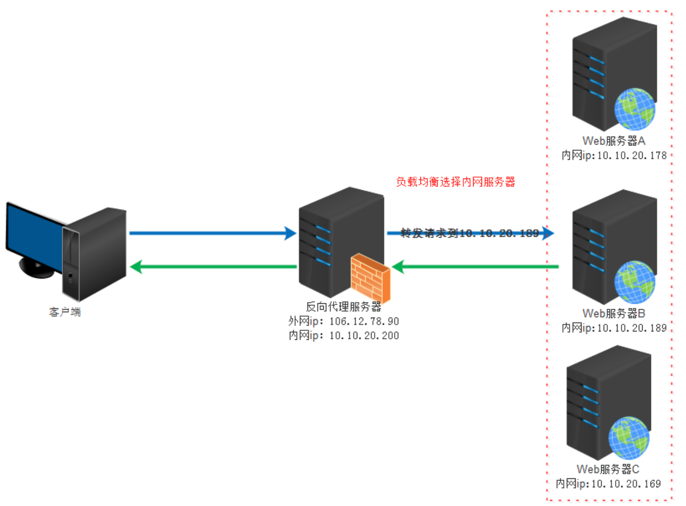
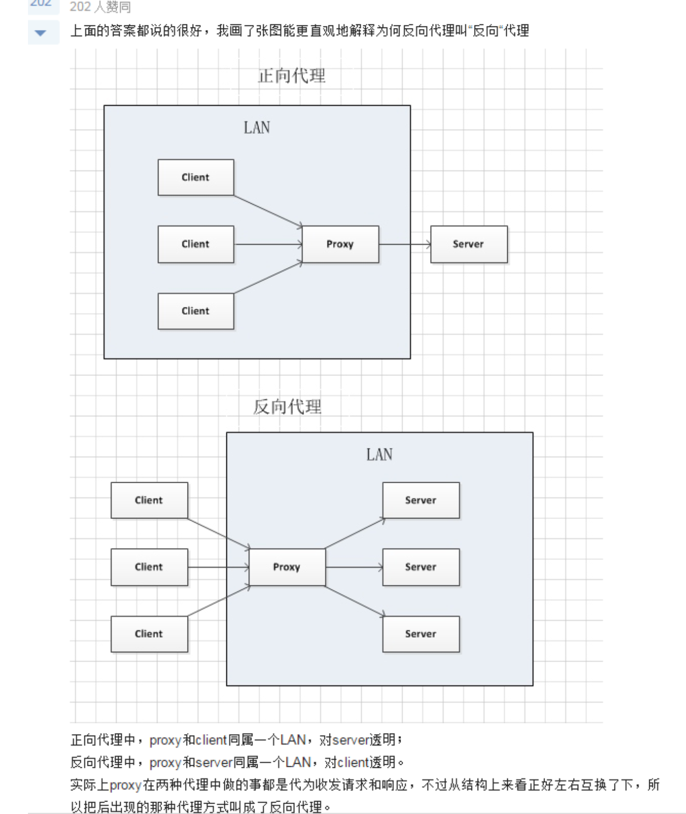
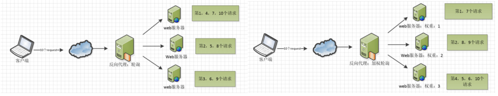
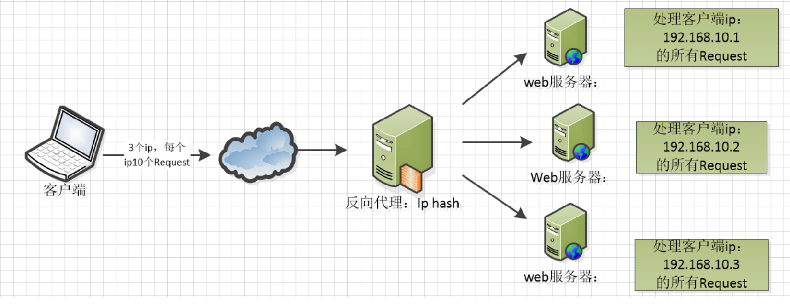

---
tags:
  - 理论
  - Nginx
---


# Nginx 基础与核心功能

> 摘要：整理 Nginx 的核心概念与常用功能，包括正向代理、反向代理、负载均衡算法以及配置文件结构。帮助测试人员理解 Nginx 作为 Web 服务器和入口网关的工作原理，为后续监控入口、测试报告托管等实战场景打下基础。

**适用场景**：理解 Web 服务器/反向代理/负载均衡的工作机制；排查测试环境入口网关、静态资源服务、请求转发相关问题。

**关键词**：Nginx、正向代理、反向代理、负载均衡、轮询、加权轮询、IP Hash、最少连接、nginx.conf、server、location、upstream。

---

## 一、正向代理

正向代理位于客户端和原始服务器之间。客户端向代理服务器发送请求并指定目标，代理服务器再向原始服务器转发请求并返回结果。


**正向代理的典型用途**：

- 访问原本无法直接访问的资源；
- 做缓存，加速资源访问；
- 对客户端访问进行授权和认证；
- 记录用户访问记录（上网行为管理），对外隐藏用户信息。

---

## 二、反向代理

反向代理服务器接受来自互联网的连接请求，将请求转发给内部网络上的服务器，并将结果返回给客户端。此时代理服务器对外表现为一个服务器。



**反向代理的典型作用**：

- 保证内网安全，可提供 WAF 能力以阻止 Web 攻击；
- 实现负载均衡，优化后端服务器负载。

### 正向代理与反向代理的区别



| 维度 | 正向代理 | 反向代理 |
|---|---|---|
| 服务对象 | 客户端 | 服务端 |
| 客户端是否感知 | 需要配置代理地址 | 无需感知 |
| 主要作用 | 访问控制、缓存、隐藏客户端 | 负载均衡、安全防护、隐藏服务端 |

---

## 三、负载均衡

### 3.1 基本概念

Nginx 接收到的请求数量称为负载量。按照一定规则将请求分发到不同服务器处理的过程，就是负载均衡。

### 3.2 Nginx 内置负载均衡算法

Nginx 提供内置策略和扩展策略，内置策略包括：

- **轮询（Round Robin）**：默认策略，按顺序分配请求；
- **加权轮询（Weighted Round Robin）**：按权重分配，权重越高被分配概率越大；
- **IP Hash**：按客户端 IP 的 Hash 结果分配，同一 IP 固定到同一台服务器，可解决 Session 不共享问题。





---

## 四、Nginx 配置文件结构

Nginx 配置文件主要分为四部分：

| 区块 | 作用 |
|---|---|
| `main` | 全局设置，影响其他所有部分 |
| `server` | 虚拟主机设置，指定域名、IP、端口 |
| `upstream` | 上游服务器设置，用于反向代理和负载均衡 |
| `location` | URL 匹配特定位置后的设置 |

继承关系：`server` 继承 `main`，`location` 继承 `server`；`upstream` 既不会继承也不会被继承。

### 4.1 快速启动 Nginx 容器

```bash
docker run --name nginx-test -p 8080:80 -d nginx
```

进入容器查看默认配置文件：

```bash
docker exec -ti nginx-test sh
find / -name nginx.conf        # /etc/nginx/nginx.conf
find / -name default.conf      # /etc/nginx/conf.d/default.conf
```

### 4.2 默认 `nginx.conf`

```nginx
user  nginx;                      # 运行用户和用户组
worker_processes  1;              # 工作进程数，建议等于 CPU 核心数
error_log  /var/log/nginx/error.log warn;
pid        /var/run/nginx.pid;

events {
    worker_connections  1024;     # 单个进程最大连接数
}

http {
    include       /etc/nginx/mime.types;
    default_type  application/octet-stream;

    log_format  main  '$remote_addr - $remote_user [$time_local] "$request" '
                      '$status $body_bytes_sent "$http_referer" '
                      '"$http_user_agent" "$http_x_forwarded_for"';

    access_log  /var/log/nginx/access.log  main;

    sendfile        on;
    keepalive_timeout  65;

    include /etc/nginx/conf.d/*.conf;
}
```

### 4.3 默认虚拟主机配置 `default.conf`

```nginx
server {
    listen       80;
    server_name  localhost;

    location / {
        root   /usr/share/nginx/html;
        index  index.html index.htm;
    }

    error_page   500 502 503 504  /50x.html;
    location = /50x.html {
        root   /usr/share/nginx/html;
    }
}
```

---

## 五、测试关注点

| 测试维度 | 关注点 |
|---|---|
| 功能测试 | 正向代理、反向代理、负载均衡是否按预期工作 |
| 配置文件 | `nginx -t` 是否能通过语法检查；重载后配置是否生效 |
| 负载均衡 | 不同算法下请求分布是否符合预期；后端节点故障时是否自动剔除 |
| 高可用 | Nginx 单点故障时是否有备份或 Keepalived 等方案 |
| 日志分析 | access_log 中的请求耗时、状态码、来源 IP 是否可用于测试分析 |
| 性能测试 | 并发连接数、吞吐量、响应时延是否满足测试场景需求 |
| 安全测试 | 是否隐藏了后端真实 IP；是否存在目录遍历、非法访问等风险 |

---

## 参考链接

- [Nginx 配置详解 - 菜鸟教程](https://www.runoob.com/w3cnote/nginx-setup-intro.html)
- [Nginx 教程 - W3Cschool](https://www.w3cschool.cn/nginx/nginx-d1aw28wa.html)