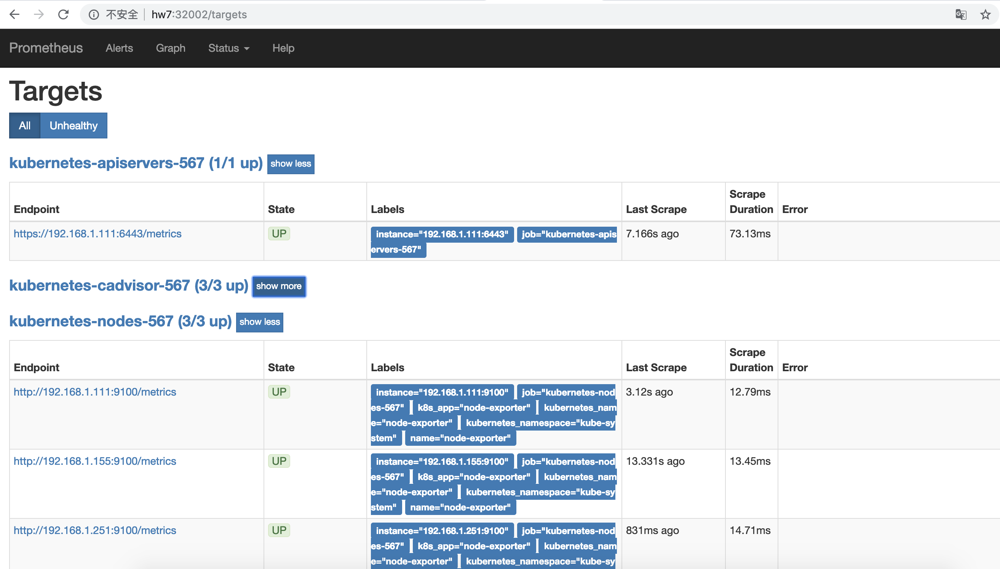
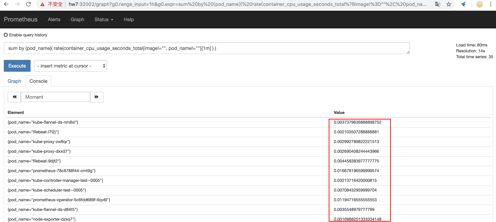
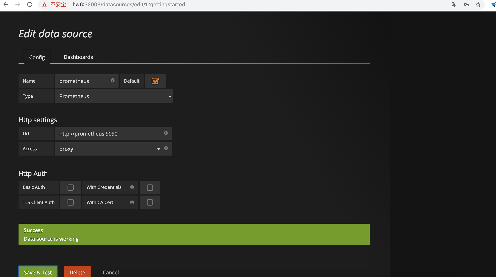
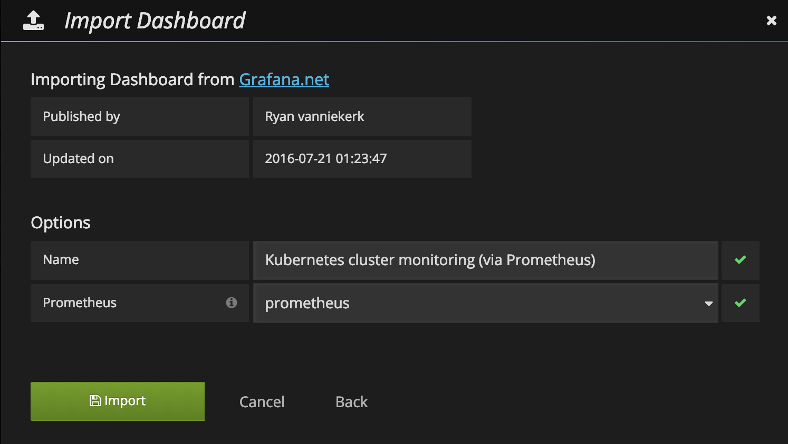
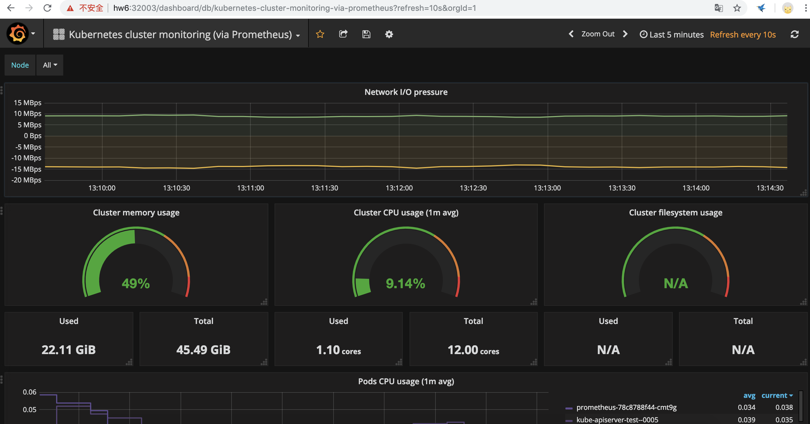
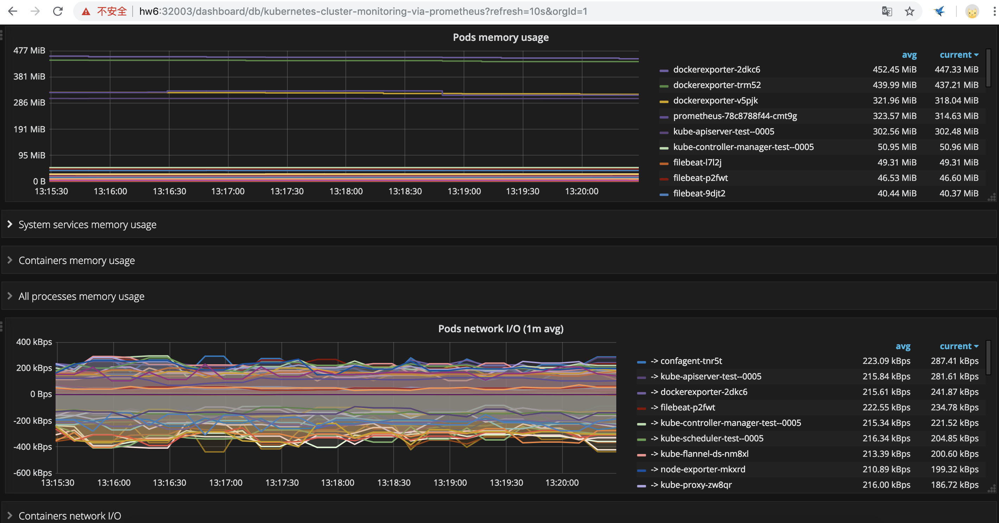
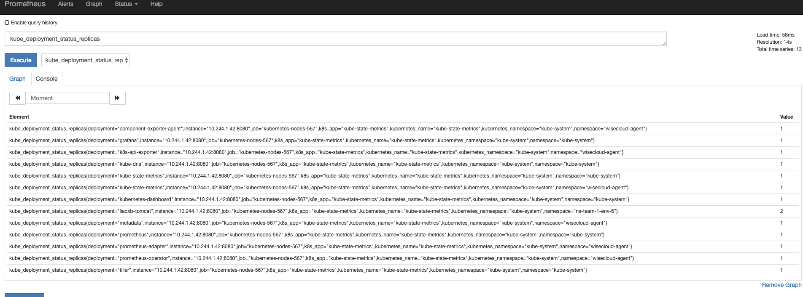
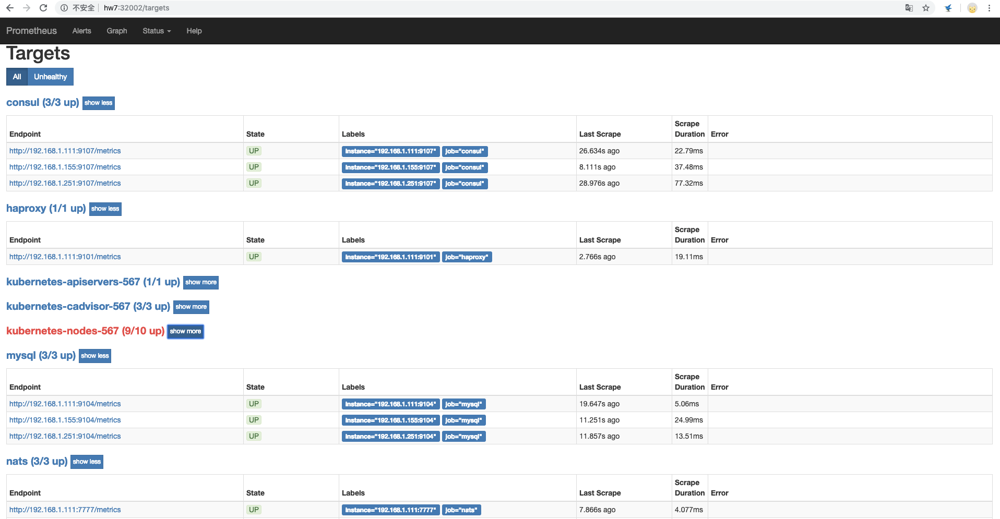

---
tags:
  - 实战
  - Kubernetes
  - 监控
---


# K8s 监控

> 摘要：在 Kubernetes v1.8.6 集群上部署 Prometheus + Grafana + node-exporter + kube-state-metrics 监控体系，覆盖基础设施层、K8s 集群层、应用资源对象层和中间件层的指标采集与展示。可作为云原生可观测性测试环境搭建的参考。

**适用场景**：搭建 K8s 监控测试环境、验证 Prometheus 服务发现、学习云原生可观测性体系、为稳定性测试和故障演练准备监控基线。

**关键词**：Prometheus、Grafana、node-exporter、kube-state-metrics、cAdvisor、服务发现、NodePort、exporter、可观测性。

---

## 一、监控分层与组件选型

在 K8s 环境下，Prometheus 监控通常覆盖以下四个层次：

| 监控层次 | 代表组件 | 采集内容 |
|---|---|---|
| 基础设施层 | node-exporter | 节点 CPU、内存、磁盘 I/O、网络吞吐 |
| K8s 集群层 | cAdvisor（kubelet 内置）+ apiserver | Pod/容器资源使用、K8s 组件状态 |
| 应用资源对象层 | kube-state-metrics | Deployment、Pod、DaemonSet、Job 等资源对象状态 |
| 中间件层 | 各中间件 exporter | MySQL、Redis、Consul、HAProxy、NATS 等 |

---

## 二、环境介绍

- 操作系统：CentOS Linux 7.4 64bit
- K8s 版本：v1.8.6
- Master 节点：192.168.1.111/24
- Worker 节点：192.168.1.155/24、192.168.1.251/24

---

## 三、部署 node-exporter

node-exporter 以 DaemonSet 方式运行在每个节点上，默认暴露 9100 端口，采集节点级指标。

```yaml
# node-exporter.yaml
apiVersion: v1
kind: Service
metadata:
  labels:
    k8s-app: node-exporter
    name: node-exporter
  name: node-exporter
  namespace: kube-system
  annotations:
    prometheus.io/scrape: 'true'
spec:
  ports:
  - name: http
    port: 9100
    protocol: TCP
  selector:
    app: node-exporter
  type: ClusterIP
---
apiVersion: extensions/v1beta1
kind: DaemonSet
metadata:
  name: node-exporter
  namespace: kube-system
  labels:
    app: node-exporter
spec:
  updateStrategy:
    type: RollingUpdate
  template:
    metadata:
      labels:
        app: node-exporter
    spec:
      hostNetwork: true
      containers:
      - image: prom/node-exporter:v0.16.0
        imagePullPolicy: IfNotPresent
        name: node-exporter
        ports:
        - containerPort: 9100
          hostPort: 9100
          name: http
        volumeMounts:
        - name: local-timezone
          mountPath: "/etc/localtime"
      tolerations:
      - key: "node-role.kubernetes.io/master"
        operator: "Exists"
        effect: "NoSchedule"
      hostPID: true
      restartPolicy: Always
      volumes:
      - name: local-timezone
        hostPath:
          path: /etc/localtime
```

部署并验证：

```bash
kubectl create -f node-exporter.yaml
kubectl get pods -o wide -n kube-system | grep node-exporter
kubectl get svc -o wide -n kube-system | grep node-exporter
```



---

## 四、部署 Prometheus

### 4.1 RBAC 授权

Prometheus 需要访问 K8s apiserver 获取服务发现信息：

```yaml
# prometheus-rbac.yaml
apiVersion: rbac.authorization.k8s.io/v1
kind: ClusterRole
metadata:
  name: prometheus
rules:
- apiGroups: [""]
  resources:
  - nodes
  - nodes/proxy
  - services
  - endpoints
  - pods
  verbs: ["get", "list", "watch"]
- apiGroups:
  - extensions
  resources:
  - ingresses
  verbs: ["get", "list", "watch"]
- nonResourceURLs: ["/metrics"]
  verbs: ["get"]
---
apiVersion: v1
kind: ServiceAccount
metadata:
  name: prometheus
  namespace: kube-system
---
apiVersion: rbac.authorization.k8s.io/v1
kind: ClusterRoleBinding
metadata:
  name: prometheus
roleRef:
  apiGroup: rbac.authorization.k8s.io
  kind: ClusterRole
  name: prometheus
subjects:
- kind: ServiceAccount
  name: prometheus
  namespace: kube-system
```

### 4.2 Prometheus 配置 ConfigMap

```yaml
# prometheus-cm.yaml
apiVersion: v1
kind: ConfigMap
metadata:
  name: prometheus-config
  namespace: kube-system
data:
  prometheus.yml: |
    global:
      scrape_interval:     15s
      evaluation_interval: 15s

    scrape_configs:
    - job_name: 'kubernetes-apiservers'
      kubernetes_sd_configs:
      - role: endpoints
      scheme: https
      tls_config:
        ca_file: /var/run/secrets/kubernetes.io/serviceaccount/ca.crt
      bearer_token_file: /var/run/secrets/kubernetes.io/serviceaccount/token
      relabel_configs:
      - source_labels: [__meta_kubernetes_namespace, __meta_kubernetes_service_name, __meta_kubernetes_endpoint_port_name]
        action: keep
        regex: default;kubernetes;https

    - job_name: 'kubernetes-cadvisor'
      kubernetes_sd_configs:
      - role: node
      scheme: https
      tls_config:
        ca_file: /var/run/secrets/kubernetes.io/serviceaccount/ca.crt
      bearer_token_file: /var/run/secrets/kubernetes.io/serviceaccount/token
      relabel_configs:
      - action: labelmap
        regex: __meta_kubernetes_node_label_(.+)
      - target_label: __address__
        replacement: kubernetes.default.svc:443
      - source_labels: [__meta_kubernetes_node_name]
        regex: (.+)
        target_label: __metrics_path__
        replacement: /api/v1/nodes/${1}/proxy/metrics/cadvisor

    - job_name: 'kubernetes-nodes'
      kubernetes_sd_configs:
      - role: endpoints
      relabel_configs:
      - source_labels: [__meta_kubernetes_service_annotation_prometheus_io_scrape]
        action: keep
        regex: true
      - source_labels: [__meta_kubernetes_service_annotation_prometheus_io_scheme]
        action: replace
        target_label: __scheme__
        regex: (https?)
      - source_labels: [__meta_kubernetes_service_annotation_prometheus_io_path]
        action: replace
        target_label: __metrics_path__
        regex: (.+)
      - source_labels: [__address__, __meta_kubernetes_service_annotation_prometheus_io_port]
        action: replace
        target_label: __address__
        regex: ([^:]+)(?::\d+)?;(\d+)
        replacement: $1:$2
      - action: labelmap
        regex: __meta_kubernetes_service_label_(.+)
      - source_labels: [__meta_kubernetes_namespace]
        action: replace
        target_label: kubernetes_namespace
      - source_labels: [__meta_kubernetes_service_name]
        action: replace
        target_label: kubernetes_name
```

### 4.3 Prometheus Deployment

```yaml
# prometheus-deploy.yaml
apiVersion: apps/v1beta2
kind: Deployment
metadata:
  labels:
    name: prometheus-deployment
  name: prometheus
  namespace: kube-system
spec:
  replicas: 1
  selector:
    matchLabels:
      app: prometheus
  template:
    metadata:
      labels:
        app: prometheus
    spec:
      containers:
      - image: prom/prometheus:v2.7.1
        name: prometheus
        command:
        - "/bin/prometheus"
        args:
        - "--config.file=/etc/prometheus/prometheus.yml"
        - "--storage.tsdb.path=/prometheus"
        - "--storage.tsdb.retention=24h"
        ports:
        - containerPort: 9090
          protocol: TCP
        volumeMounts:
        - mountPath: "/prometheus"
          name: data
        - mountPath: "/etc/prometheus"
          name: config-volume
        resources:
          requests:
            cpu: 100m
            memory: 100Mi
          limits:
            cpu: 500m
            memory: 2500Mi
      serviceAccountName: prometheus
      imagePullSecrets:
        - name: regsecret
      volumes:
      - name: data
        hostPath:
          path: /prometheus
      - name: config-volume
        configMap:
          name: prometheus-config
```

### 4.4 Prometheus Service

```yaml
# prometheus-svc.yaml
kind: Service
apiVersion: v1
metadata:
  labels:
    app: prometheus
  name: prometheus
  namespace: kube-system
spec:
  type: NodePort
  ports:
  - port: 9090
    targetPort: 9090
    nodePort: 32002
  selector:
    app: prometheus
```

### 4.5 部署并验证

```bash
kubectl create -f prometheus-rbac.yaml
kubectl create -f prometheus-cm.yaml
kubectl create -f prometheus-deploy.yaml
kubectl create -f prometheus-svc.yaml
kubectl get pods -o wide -n kube-system | grep prometheus
```

通过 `http://<NodeIP>:32002` 访问 Prometheus UI，在 Target 页面确认各 job 已正常连接。

查询每个 Pod 的 CPU 使用率：

```promql
sum by (pod_name)( rate(container_cpu_usage_seconds_total{image!="", pod_name!=""}[1m] ) )
```





---

## 五、部署 Grafana

### 5.1 Grafana Deployment + Service

```yaml
# grafana.yaml
apiVersion: v1
kind: Service
metadata:
  name: grafana
  namespace: kube-system
spec:
  type: NodePort
  ports:
  - port: 3000
    targetPort: 3000
    nodePort: 32003
  selector:
    app: grafana
---
apiVersion: extensions/v1beta1
kind: Deployment
metadata:
  labels:
    app: grafana
  name: grafana
  namespace: kube-system
spec:
  replicas: 1
  revisionHistoryLimit: 2
  template:
    metadata:
      labels:
        app: grafana
    spec:
      containers:
      - image: grafana/grafana:4.2.0
        name: grafana
        imagePullPolicy: Always
        ports:
        - containerPort: 3000
        env:
          - name: GF_AUTH_BASIC_ENABLED
            value: "true"
          - name: GF_AUTH_ANONYMOUS_ENABLED
            value: "false"
```

部署并访问：

```bash
kubectl create -f grafana.yaml
```

通过 `http://<NodeIP>:32003` 访问 Grafana，默认账号密码均为 `admin`。

### 5.2 配置数据源并导入 Dashboard

1. 添加 Prometheus 数据源：



2. 导入社区 Dashboard，推荐使用 [Kubernetes cluster monitoring (via Prometheus)](https://grafana.com/dashboards/162)：



3. 查看主机监控数据：



4. 查看 Pod 和 Container 监控数据：



---

## 六、部署 kube-state-metrics

kube-state-metrics 用于暴露 K8s 资源对象状态指标（Deployment、Pod、DaemonSet、Job、CronJob 等），是对 node-exporter 和 cAdvisor 指标的重要补充。

```bash
# 部署 kube-state-metrics（使用官方 kubernetes 目录下的 YAML）
kubectl create -f kube-state-metrics/kubernetes/
```

由于 `kube-state-metrics-service.yaml` 中包含了 `prometheus.io/scrape: 'true'` 注解，Prometheus 会自动在 `kubernetes-nodes` job 下发现并拉取指标。

验证：在 Prometheus UI 中查询 K8s 集群中 Deployment 的数量。



---

## 七、中间件监控

对于 MySQL、Redis、Consul、HAProxy、NATS 等中间件，需要部署各自的 exporter，并在 Prometheus ConfigMap 中追加 job 配置：

```yaml
- job_name: consul
  scrape_interval: 30s
  scrape_timeout: 30s
  metrics_path: /metrics
  scheme: http
  static_configs:
  - targets:
    - 192.168.1.111:9107
    - 192.168.1.155:9107
    - 192.168.1.251:9107

- job_name: haproxy
  scrape_interval: 30s
  scrape_timeout: 30s
  metrics_path: /metrics
  scheme: http
  static_configs:
  - targets:
    - 192.168.1.111:9101

- job_name: mysql
  scrape_interval: 30s
  scrape_timeout: 30s
  metrics_path: /metrics
  scheme: http
  static_configs:
  - targets:
    - 192.168.1.111:9104
    - 192.168.1.155:9104
    - 192.168.1.251:9104

- job_name: nats
  scrape_interval: 30s
  scrape_timeout: 30s
  metrics_path: /metrics
  scheme: http
  static_configs:
  - targets:
    - 192.168.1.111:7777
    - 192.168.1.155:7777
    - 192.168.1.251:7777

- job_name: redis
  scrape_interval: 30s
  scrape_timeout: 30s
  metrics_path: /metrics
  scheme: http
  static_configs:
  - targets:
    - 192.168.1.155:9121
```

更新配置后：

```bash
kubectl apply -f prometheus-cm.yaml
# 重启 Prometheus Pod 使配置生效
kubectl rollout restart deployment/prometheus -n kube-system
```

---

## 八、测试关注点

| 测试维度 | 关注点 |
|---|---|
| 组件部署正确性 | node-exporter、Prometheus、Grafana、kube-state-metrics Pod 是否 Running |
| 服务发现 | Prometheus Target 页面是否自动发现 node-exporter 和 kube-state-metrics |
| 指标完整性 | 基础设施、容器、K8s 资源对象、中间件指标是否都能正常采集 |
| 数据连续性 | Prometheus 存储路径是否持久化，Pod 重启后历史数据是否保留 |
| 告警可观测性 | 关键指标（CPU、内存、磁盘、Pod 异常重启）是否可用于后续告警规则 |
| 性能影响 | exporter 和 Prometheus 自身对节点 CPU/内存的额外开销 |
| 权限安全 | RBAC 权限是否最小化，ServiceAccount 是否仅用于监控用途 |

---

## 九、部署小结

- **基础设施层**：node-exporter + cAdvisor 负责节点与容器资源指标；
- **K8s 集群层**：kube-state-metrics 负责资源对象状态指标；
- **应用/中间件层**：各 exporter + Prometheus 静态配置负责；
- **展示层**：Grafana 对接 Prometheus，导入社区 Dashboard 快速可视化。

---

## 参考链接

- [Kubernetes 中文社区 - Prometheus 监控](https://www.kubernetes.org.cn/3418.html)
- [Prometheus GitHub](https://github.com/prometheus)
- [kube-state-metrics GitHub](https://github.com/kubernetes/kube-state-metrics)