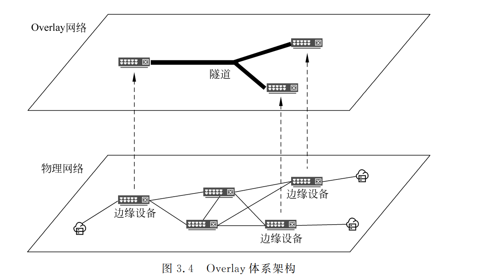
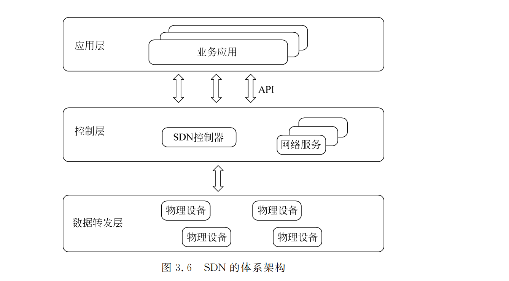

---
tags:
  - 理论
  - 网络
  - SDN
---

# 网络虚拟化与 SDN

> 摘要：整理云计算数据中心网络从传统三层架构向 Spine-Leaf 演进的背景，以及 Overlay、VXLAN、SDN 的核心概念。帮助测试人员理解云网络基础设施的工作原理，明确网络虚拟化场景下的测试关注点。

**适用场景**：测试云服务器、VPC、子网、安全组、负载均衡等云计算网络功能；排查虚拟机/容器跨节点通信、网络隔离、南北向与东西向流量问题。

**关键词**：数据中心网络、Underlay、Overlay、VXLAN、VTEP、SDN、控制层、数据转发层、网络虚拟化。

---

## 一、数据中心网络演进

虚拟化技术在云计算中被广泛应用，大量的虚拟机和容器部署于云数据中心，这会带来两个最直接的结果：

- 网络流量的爆发式增长；
- 数据中心网络流量模型从南北向为主转变为了以东西向为主。

虚拟机之间的互通、虚拟机的迁移、存储数据的同步等场景，会占用更多东西向流量带宽。数据中心网络的架构也从传统的烟囱式架构向分布式架构转变，从纵向扩展向横向扩展演进。

随着 VXLAN、SDN 等技术的出现，云计算场景下，业界开始将数据中心网络抽象为 **Underlay 网络（物理网络）** 和 **Overlay 网络（叠加网络）**。负责 VXLAN 封装的 VTEP（VXLAN Tunnel EndPoint，VXLAN 隧道端点）下沉到接入交换机或者物理服务器，数据中心的物理网络只需要提供三层可达的通道即可。数据中心网络开始由传统的“核心 + 汇聚 + 接入”三层架构向“骨干节点（Spine）+ 叶子节点（Leaf）”的二层架构演进。

---

## 二、Overlay 网络虚拟化技术

Overlay 在网络领域指的是一种在物理网络架构上叠加虚拟网络的模式。其大体框架是：对基础网络不进行大规模修改的条件下，实现应用在网络上的承载，并能与其他网络业务分离。

针对传统 VLAN 网络虚拟化技术的两个局限性，Overlay 在很大程度上提供了全新的解决方案：

1. **虚拟机创建的灵活性**：Overlay 是一种封装在 IP 报文之上的新的数据格式，可以在三层路由的网络中建立起逻辑的二层网络，因而具备大规模扩展能力。同时，IP 网络本身具备很强的故障自愈和负载均衡能力，采用 Overlay 技术后，利用现有网络进行技术迭代，便可用于支撑新的云计算业务。
2. **网络隔离规模的扩展**：在 Overlay 技术中引入了类似 VLAN ID 的用户标识，但对标识的范围做了很大的扩展。例如 VXLAN 技术引入的 VXLAN ID，支持上千万级别的用户标识。

Overlay 网络由边缘设备、控制平面和转发平面组成：

- **边缘设备**：与虚拟机直接相连的设备；
- **控制平面**：负责虚拟隧道的建立维护以及主机位置信息的通告；
- **转发平面**：承载 Overlay 报文的物理网络。

---

## 三、SDN 网络

SDN 将网络划分为数据转发层和控制层，实现控制层与数据转发层分离：

- **控制层**更灵活，负责集中决策；
- **数据转发层**更标准化，负责按流表执行转发。

通过集中控制，网络管理员可以通过控制器的 API 编写程序，实现自动化服务部署，大大缩短业务部署周期，并实现按需动态调整。SDN 的出现使网络虚拟化更加灵活、高效，网络虚拟化已成为 SDN 的重量级应用。

当前的 SDN 网络架构通常采用控制器集群的形式：

1. 收集整个网络的拓扑和流量信息；
2. 计算流量转发路径；
3. 将转发表项发送给交换机（包括硬件交换机和 vSwitch）；
4. 交换机根据下发的转发表里的条目执行转发操作。

控制层从传统网络的单个设备剥离并集中在控制器上，转发层由交换机组成。

---

## 四、测试关注点

在云网络虚拟化和 SDN 场景下，测试人员可以关注以下方面：

| 测试维度 | 关注点 |
|---|---|
| 功能测试 | VPC、子网、安全组、路由表、负载均衡、弹性 IP 是否正确创建与隔离 |
| 东西向流量 | 同一 VPC 内、不同 VPC 间、跨可用区、跨宿主机的 VM/容器互通性 |
| 南北向流量 | 公网访问、NAT、网关高可用、带宽限制 |
| 隔离性 | 不同租户/不同 VPC 的流量是否严格隔离，VXLAN ID 是否正确分配 |
| 迁移场景 | VM/容器热迁移时，Overlay 隧道是否及时更新，业务是否中断 |
| 故障演练 | 控制器节点故障、Leaf/Spine 交换机故障、VTEP 故障时的自愈能力 |
| 性能测试 | VXLAN 封装/解封装带来的时延、吞吐损耗，东西向大流量场景 |
| 可见性 | 网络流量、SDN 流表、控制器日志是否可被监控和追踪 |

---

## 五、关键概念速查

| 术语 | 说明 |
|---|---|
| Underlay | 底层物理网络，提供三层可达通道 |
| Overlay | 叠加在物理网络上的虚拟网络，常用 VXLAN 封装 |
| VXLAN | 一种 Overlay 封装协议，使用 UDP 4789 端口，支持 24bit VNI |
| VTEP | VXLAN 隧道端点，负责封装/解封装 VXLAN 报文 |
| VNI | VXLAN Network Identifier，用于区分不同租户或网络 |
| SDN 控制器 | 集中控制网络转发策略，向交换机下发流表 |
| Spine-Leaf | 数据中心网络架构，Spine 作为骨干，Leaf 作为接入层 |