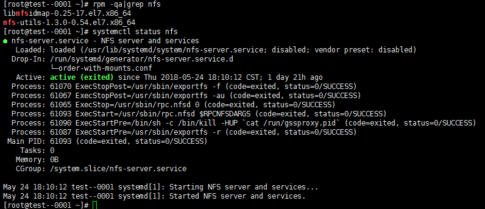

---
tags:
  - "#实战"
  - "#云计算"
  - "#NFS"
  - "#测试环境"
  - "#存储"
---

# 4.6.1 NFS 共享存储测试环境搭建

> 摘要：在 CentOS 环境下搭建 NFS（Network File System）共享存储服务，实现多台测试节点之间的文件共享。适用于测试数据共享、测试产物归档、分布式测试节点统一挂载等场景。

**适用场景**：多节点测试环境需要共享测试数据、测试脚本或测试结果；为分布式测试、日志集中收集、测试报告统一访问提供存储底座。

**关键词**：NFS、RPC、rpcbind、/etc/exports、共享目录、挂载、all_squash、root_squash。

---

## 一、NFS 基础概念

NFS（Network File System，网络文件系统）是一种在类 Unix 系统间实现磁盘文件共享的方法。它允许不同机器、不同操作系统通过网络访问位于服务器磁盘中的数据。

NFS 在文件传送过程中依赖 RPC（Remote Procedure Call）协议。因此，NFS Server 和 Client 都需要启动 RPC 服务（CentOS 7 及以后使用 `rpcbind`），双方通过 RPC 实现程序端口的对应。

| 组件 | 说明 |
|---|---|
| NFS | 文件系统，负责文件共享 |
| RPC / rpcbind | 负责信息传输和端口映射 |
| `/etc/exports` | NFS 服务端核心配置文件，定义共享目录和客户端权限 |

---

## 二、环境说明

- 服务端 IP：`192.168.1.28`
- 客户端 IP：`192.168.1.21`、`192.168.1.155`
- 操作系统：CentOS

---

## 三、安装 NFS

服务端和客户端都需要安装 `nfs-utils`：

```bash
rpm -qa | grep nfs          # 检查是否已安装
yum install nfs-utils -y    # 服务端和客户端都要安装
```



---

## 四、服务端配置

### 4.1 创建共享目录

```bash
mkdir /var/nfsshare
```

### 4.2 配置 `/etc/exports`

`/etc/exports` 是 NFS 的主要配置文件，格式为：

```text
<输出目录> [客户端1 选项] [客户端2 选项]
```

示例配置：

```text
/var/nfsshare 192.168.1.0/24(rw,sync,no_root_squash)
```

### 4.3 常用客户端指定方式

| 方式 | 示例 |
|---|---|
| 指定 IP | `192.168.8.106` |
| 指定子网 | `192.168.0.0/24` |
| 指定域名 | `wj.bsmart.com` |
| 指定域内所有主机 | `*.bsmart.com` |
| 所有主机 | `*` |

### 4.4 常用选项说明

**访问权限选项**：

| 选项 | 说明 |
|---|---|
| `ro` | 只读 |
| `rw` | 读写 |

**用户映射选项**：

| 选项 | 说明 |
|---|---|
| `all_squash` | 将所有远程访问的普通用户及组映射为匿名用户/组（nfsnobody） |
| `no_all_squash` | 与 `all_squash` 相反（默认） |
| `root_squash` | 将 root 用户及组映射为匿名用户/组（默认） |
| `no_root_squash` | 与 `root_squash` 相反 |
| `anonuid=xxx` | 指定匿名用户的 UID |
| `anongid=xxx` | 指定匿名用户组的 GID |

**其他选项**：

| 选项 | 说明 |
|---|---|
| `secure` | 限制客户端只能从小于 1024 的端口连接（默认） |
| `insecure` | 允许客户端从大于 1024 的端口连接 |
| `sync` | 同步写入内存和磁盘，保证数据一致性 |
| `async` | 异步写入，效率高但存在丢数据风险 |
| `wdelay` | 合并相关写操作以提高效率（默认） |
| `no_wdelay` | 有写操作立即执行，需与 `sync` 配合使用 |

### 4.5 启动并查看共享状态

```bash
systemctl start nfs
showmount -e localhost        # 本机查看共享状态
showmount -e 192.168.1.28     # 客户端查看服务端共享状态
```

输出示例：

```text
Export list for 192.168.1.28:
/var/nfsshare2 *
/var/nfsshare *
```

### 4.6 设置开机启动

```bash
systemctl enable rpcbind.service
systemctl enable nfs-server
```

---

## 五、客户端挂载测试

```bash
# 客户端挂载 NFS 共享目录
mount -t nfs 192.168.1.28:/var/nfsshare /mnt

# 在挂载点创建文件，验证写入是否同步到服务端
touch /mnt/test.txt
echo "hello world" > /mnt/test.txt

# 解除挂载
umount /mnt
```

---

## 六、测试关注点

| 测试维度 | 关注点 |
|---|---|
| 功能测试 | 共享目录能否正常挂载、读写、卸载 |
| 权限测试 | `rw`/`ro`、`root_squash`/`no_root_squash`、`all_squash` 是否按预期生效 |
| 隔离性 | 不同客户端之间的文件是否互相可见，是否存在越权访问 |
| 高可用 | NFS Server 重启后，客户端挂载是否自动恢复（结合 `autofs` 或 `/etc/fstab`） |
| 性能测试 | 大文件读写、并发读写场景下的吞吐和延迟 |
| 异常场景 | 网络中断后客户端是否出现卡死（`hard`/`soft`/`intr` 挂载参数的影响） |
| 数据一致性 | `sync` 与 `async` 对数据一致性的影响 |

---

## 七、常见问题

### 7.1 客户端挂载失败

**排查步骤**：

1. 确认服务端 NFS 和 rpcbind 服务已启动；
2. 确认防火墙已放行 NFS 相关端口（2049、111、mountd 等）；
3. 确认 `/etc/exports` 配置正确并已执行 `exportfs -ra` 重新加载；
4. 在客户端执行 `showmount -e <ServerIP>` 验证可见性。

### 7.2 写入权限异常

**原因**：`root_squash` 将 root 用户映射为 `nfsnobody`，导致权限不足。如需保留 root 权限，可使用 `no_root_squash`（注意安全性）。

### 7.3 网络中断后客户端命令卡死

**原因**：默认 `hard` 挂载模式下，NFS 请求会无限重试。可在测试环境中使用 `soft` 或 `intr` 参数：

```bash
mount -t nfs -o soft,intr 192.168.1.28:/var/nfsshare /mnt
```

> 生产环境需谨慎使用 `soft`，可能因超时导致数据损坏。

---

## 八、自动化挂载（可选）

在 `/etc/fstab` 中追加：

```text
192.168.1.28:/var/nfsshare /mnt nfs defaults,_netdev 0 0
```

使用 `_netdev` 确保网络就绪后再挂载，避免启动时卡死。
