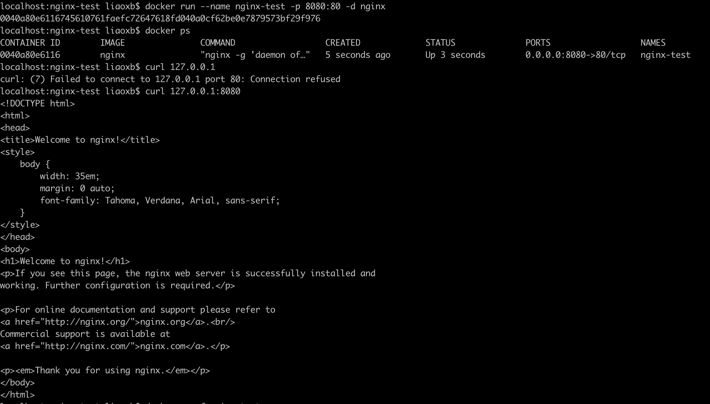
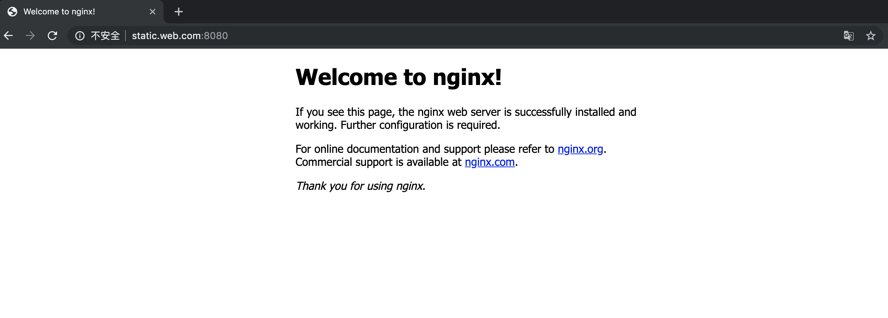
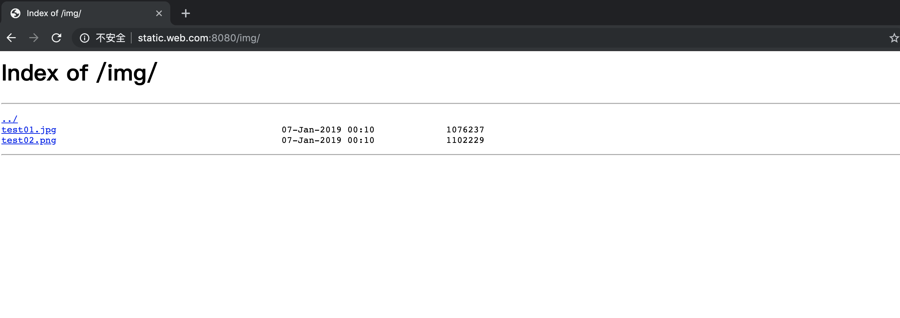
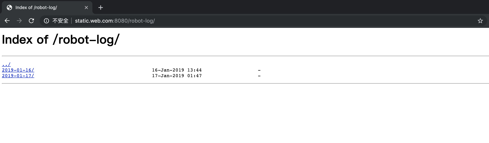
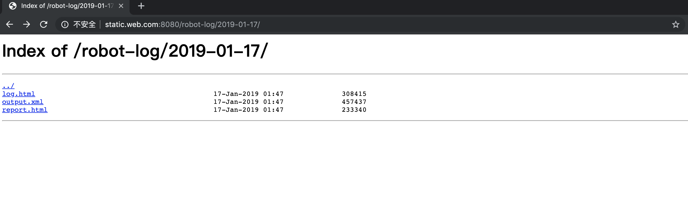
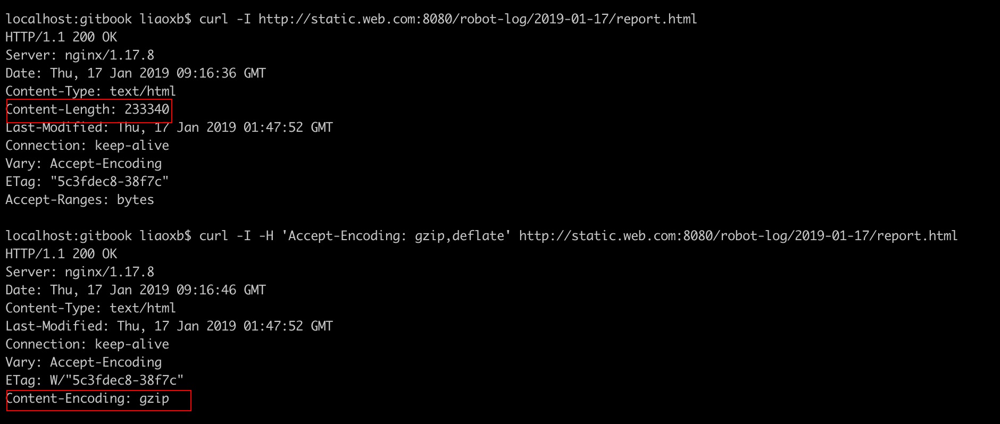
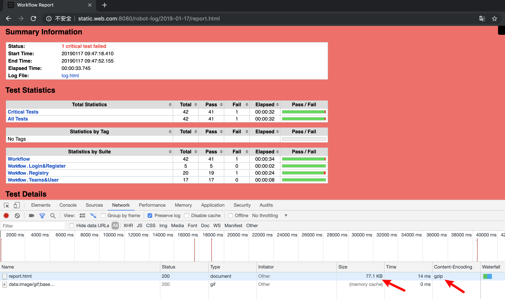

---
tags:
  - "#实战"
  - "#云计算"
  - "#Nginx"
  - "#中间件"
  - "#测试报告"
  - "#静态资源"
  - "#gzip"
---

# 4.7.3 Nginx 静态文件服务器实战（测试报告托管）

> 摘要：使用 Nginx 搭建静态文件服务器，托管测试报告、日志文件和图片等测试资产，并开启 gzip 压缩以降低传输体积。适用于测试报告集中展示、测试产物归档、团队共享访问等场景。

**适用场景**：将 Robot Framework、Pytest、Allure 等生成的测试报告部署为可访问的 Web 页面；托管测试日志、截图等静态资源；需要为测试团队提供统一的报告访问入口。

**关键词**：Nginx、静态文件服务器、测试报告、gzip、autoindex、location、root、静态资源托管。

---

## 一、搭建目标

1. 成功访问静态资源文件（图片、HTML 日志文件等）；
2. 服务器以 gzip 压缩形式返回数据，降低传输体积。

---

## 二、启动 Nginx 容器

将容器 80 端口映射到本机 8080：

```bash
docker run --name nginx-test -p 8080:80 -d nginx
```



---

## 三、准备静态资源

本地静态资源统一放在 `static-web` 目录下：

```text
.
├── nginx.conf
└── static-web
    ├── img
    │   ├── test01.jpg
    │   └── test02.png
    └── robot-log
        ├── 2019-01-16
        │   ├── log.html
        │   ├── output.xml
        │   └── report.html
        └── 2019-01-17
            ├── log.html
            ├── output.xml
            └── report.html
```

- `img` 子目录存放图片；
- `robot-log` 子目录按日期存放 Robot Framework 测试报告。

---

## 四、自定义 nginx.conf

相比容器默认配置，主要改动：

1. 开启 gzip 功能并配置相关参数；
2. 在 `server` 块中追加 `/img/` 和 `/robot-log/` 两个 `location`；
3. 修改 `server_name` 为 `static.web.com`（需在本地 `/etc/hosts` 中配置）；
4. 注释 `include /etc/nginx/conf.d/*.conf;`，保留根目录默认欢迎页。

```nginx
user  nginx;
worker_processes  1;

error_log  /var/log/nginx/error.log warn;
pid        /var/run/nginx.pid;

events {
    worker_connections  1024;
}

http {
    include       /etc/nginx/mime.types;
    default_type  application/octet-stream;

    log_format  main  '$remote_addr - $remote_user [$time_local] "$request" '
                      '$status $body_bytes_sent "$http_referer" '
                      '"$http_user_agent" "$http_x_forwarded_for"';

    access_log  /var/log/nginx/access.log  main;

    sendfile        on;
    keepalive_timeout  65;

    gzip              on;
    gzip_min_length   1k;
    gzip_buffers      4 16k;
    gzip_http_version 1.1;
    gzip_comp_level   3;
    gzip_types        text/plain application/x-javascript text/css application/xml text/javascript application/javascript image/jpeg image/jpg image/png;
    gzip_proxied      any;
    gzip_vary         on;
    gzip_disable      "MSIE [1-6]\.";

    server {
        listen       80;
        server_name  static.web.com;

        location / {
            root /usr/share/nginx/html;
            index index.html;
        }

        location /img/ {
            root /usr/share/static-web;
            autoindex on;
        }

        location /robot-log/ {
            root /usr/share/static-web;
            autoindex on;
        }
    }
}
```

---

## 五、动态配置 Nginx 容器

将自定义配置和静态资源拷贝到容器中：

```bash
docker cp nginx.conf nginx-test:/etc/nginx/
docker cp static-web nginx-test:/usr/share/
docker restart nginx-test
```

验证容器运行：

```bash
docker ps
```

---

## 六、访问静态资源

### 6.1 访问根目录

`http://static.web.com:8080/` 显示 Nginx 默认欢迎页：



### 6.2 访问图片目录

`http://static.web.com:8080/img/` 列出图片文件：



### 6.3 访问测试报告目录

`http://static.web.com:8080/robot-log/` 按日期列出测试报告：





---

## 七、gzip 配置详解

Nginx 通过 `ngx_http_gzip_module` 模块拦截请求，对支持的类型进行 gzip 压缩。该模块默认集成，无需重新编译，直接开启即可。

```nginx
gzip              on;               # 开启 gzip
gzip_min_length   1k;               # 小于该值的文件不压缩
gzip_buffers      4 16k;            # 压缩缓冲区大小
gzip_http_version 1.1;              # 针对 HTTP/1.1 启用
gzip_comp_level   3;                # 压缩级别 1-9，越大压缩率越高越耗 CPU
gzip_types        text/plain application/x-javascript text/css application/xml text/javascript application/javascript image/jpeg image/jpg image/png;
gzip_proxied      any;              # 对任意代理请求启用压缩
gzip_vary         on;               # 在响应头中添加 Vary: Accept-Encoding
gzip_disable      "MSIE [1-6]\.";   # 禁用 IE 6 gzip
```

### 7.1 压缩效果对比

未开启压缩时，返回原始 HTML，Content-Length 较大：



请求头带 `Accept-Encoding: gzip,deflate` 时，响应头出现 `Content-Encoding: gzip`，表示压缩生效：



通过浏览器访问同一页面，可直观看到压缩后的体积（例如从 228 KB 降至 77.1 KB）。

---

## 八、测试关注点

| 测试维度 | 关注点 |
|---|---|
| 功能测试 | 根目录、/img/、/robot-log/ 路径是否都能正常访问 |
| 目录索引 | `autoindex on` 是否正确列出文件列表 |
| gzip 压缩 | 请求头带 `Accept-Encoding: gzip` 时，响应是否返回压缩内容且体积减小 |
| MIME 类型 | HTML、CSS、JS、图片等文件是否按正确类型返回 |
| 缓存策略 | 静态资源是否配置了合理的缓存头，避免重复下载 |
| 权限安全 | 是否限制访问容器外目录；是否禁止下载敏感文件 |
| 日志记录 | access_log 是否可用于统计报告访问次数和访问来源 |
| 可扩展性 | 新增报告目录时，是否只需复制文件无需重启 Nginx |

---

## 参考链接

- [Nginx 教程 - W3Cschool](https://www.w3cschool.cn/nginx/nginx-d1aw28wa.html)
