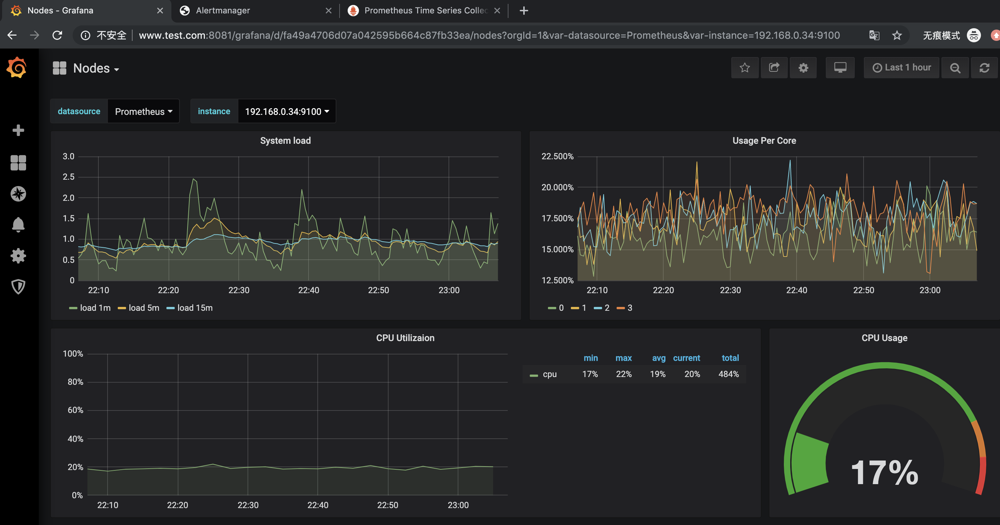
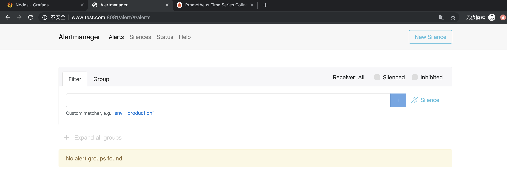
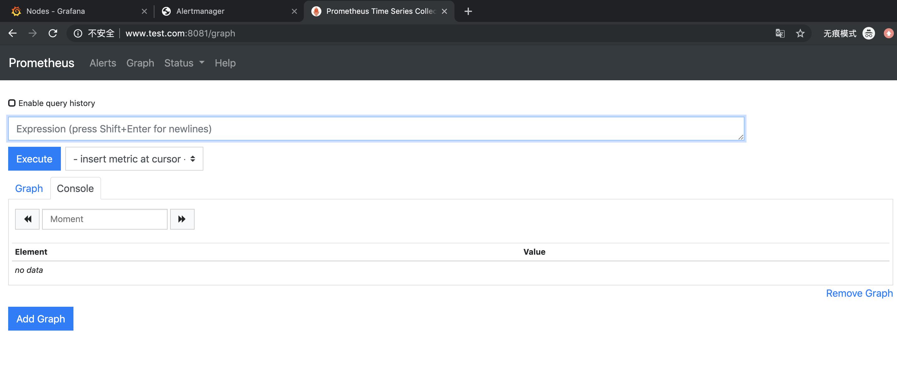

---
tags:
  - 实战
  - Nginx
  - 监控
---


# Nginx 反向代理实战（监控入口）

> 摘要：通过 Nginx 反向代理 + 负载均衡，为 Prometheus、Grafana、Alertmanager 等监控组件提供统一的 Web 访问入口。解决测试环境中需要记忆多个节点 IP 和 NodePort 的问题，提升测试人员访问监控系统的便利性。

**适用场景**：测试环境部署了 Prometheus/Grafana 等监控系统，需要通过统一域名/入口访问；需要为后端多个监控实例做负载均衡和高可用入口。

**关键词**：Nginx、反向代理、负载均衡、upstream、proxy_pass、Prometheus、Grafana、Alertmanager、NodePort、Docker。

---

## 一、需求背景

测试环境部署了一套监控系统后，测试人员经常需要访问 Web 界面分析数据或定位问题。但直接访问存在以下不便：

- 需要找到 Pod 运行的主机 IP 和 Service 暴露的 NodePort；
- 多个监控组件有各自的访问地址，记忆成本高；
- 当后端监控实例迁移或扩容时，访问地址会发生变化。

通过 Nginx 反向代理 + 负载均衡，可以快速统一访问入口。例如：

- `http://www.test.com/` → Prometheus
- `http://www.test.com/alert/` → Alertmanager
- `http://www.test.com/grafana/` → Grafana

---

## 二、查看监控服务信息

Prometheus 和 Grafana 均以 NodePort 形式暴露服务：

```bash
# Grafana
kubectl get po,svc | grep grafana
```

输出示例：

```text
pod/grafana-6c5f687b5b-79qf8   1/1   Running   0   56m
service/grafana   NodePort   10.104.106.121   <none>   3000:31962/TCP   12d
```

```bash
# Prometheus
kubectl get po,svc | grep prometheus
```

输出示例：

```text
pod/prometheus-68d7459bb-cmnmn   5/5   Running   0   2d
service/prometheus   NodePort   10.99.169.156   <none>   81:32001/TCP,9093:32003/TCP   2d
```

此时可以通过集群内主机内网 IP + 端口直接访问监控系统：

```bash
curl 192.168.0.34:32001
curl 192.168.0.35:32001
curl 192.168.0.36:32001
```

输出：

```html
<a href="/graph">Found</a>.
```

---

## 三、Nginx 反向代理配置

### 3.1 `default.conf`

```nginx
# 后端 Prometheus 服务器列表
upstream prometheus_server {
    server 192.168.0.34:32001 weight=1;
    server 192.168.0.35:32001 weight=2;
    server 192.168.0.36:32001 weight=3;
}

# 后端 Alertmanager 服务器列表
upstream alert_server {
    server 192.168.0.34:32003;
    server 192.168.0.35:32003;
    server 192.168.0.36:32003;
}

# 后端 Grafana 服务器列表
upstream grafana_server {
    server 192.168.0.34:31962;
    # server 192.168.0.35:31962;
    # server 192.168.0.36:31962;
}

server {
    listen       80;
    server_name  www.test.com;

    proxy_headers_hash_max_size     51200;
    proxy_headers_hash_bucket_size  6400;
    proxy_set_header                Host             $host;
    proxy_set_header                X-Real-IP        $remote_addr;
    proxy_set_header                X-Forwarded-For  $proxy_add_x_forwarded_for;

    location / {
        proxy_pass  http://prometheus_server/;
        proxy_connect_timeout  30s;
    }

    location /alert/ {
        proxy_pass  http://alert_server/;
        proxy_connect_timeout  30s;
    }

    location /grafana/ {
        proxy_pass  http://grafana_server/;
        proxy_connect_timeout  30s;
    }
}
```

### 3.2 关键配置说明

| 指令 | 说明 |
|---|---|
| `upstream` | 定义后端服务器池，支持加权轮询 |
| `proxy_pass` | 将请求转发到指定的 upstream |
| `proxy_set_header` | 透传真实客户端 IP 和 Host 头 |
| `proxy_connect_timeout` | 与后端建立连接的超时时间 |

---

## 四、快速启动 Nginx 容器

使用 Makefile 实现三步操作：启动容器、拷贝配置、重启容器。

```makefile
# Makefile
run:
	docker rm -f nginx-web
	docker run -d -p 8081:80 --name nginx-web nginx
	docker cp default.conf nginx-web:/etc/nginx/conf.d/
	docker restart nginx-web
```

执行：

```bash
make run
```

输出示例：

```text
nginx-web
229484284a78d84800527337eb7a074d42ff62987cb8e479a0d6c4c65b586156
nginx-web
nginx-web
```

验证容器运行：

```bash
docker ps | grep nginx-web
```

---

## 五、访问验证

在本地 `/etc/hosts` 中配置 `www.test.com` 指向 Nginx 所在主机 IP，然后通过浏览器访问：

- Grafana Dashboard：`http://www.test.com:8081/grafana/`



- Alertmanager UI：`http://www.test.com:8081/alert/`



- Prometheus UI：`http://www.test.com:8081/`



---

## 六、负载均衡策略扩展

### 6.1 轮询

```nginx
upstream bck_testing_01 {
    server 192.168.250.220:8080;
    server 192.168.250.221:8080;
    server 192.168.250.222:8080;
}
```

### 6.2 加权轮询

```nginx
upstream bck_testing_01 {
    server 192.168.250.220:8080 weight=3;
    server 192.168.250.221:8080;
    server 192.168.250.222:8080;
}
```

### 6.3 最少连接

```nginx
upstream bck_testing_01 {
    least_conn;
    server 192.168.250.220:8080;
    server 192.168.250.221:8080;
    server 192.168.250.222:8080;
}
```

### 6.4 IP Hash

```nginx
upstream bck_testing_01 {
    ip_hash;
    server 192.168.250.220:8080;
    server 192.168.250.221:8080;
    server 192.168.250.222:8080;
}
```

---

## 七、测试关注点

| 测试维度 | 关注点 |
|---|---|
| 功能测试 | 各 location 路径是否正确转发到对应后端服务 |
| 负载均衡 | 加权轮询是否按权重分配请求；后端节点故障时是否自动剔除 |
| 健康检查 | Nginx 是否具备主动健康检查机制（社区版需借助第三方模块或脚本） |
| 会话保持 | 如需 Session 保持，是否启用 `ip_hash` 或共享 Session |
| 请求头透传 | `X-Real-IP`、`X-Forwarded-For` 是否正确透传，便于后端审计 |
| 超时与容错 | `proxy_connect_timeout`、`proxy_read_timeout` 是否合理，避免后端慢请求拖垮入口 |
| 安全性 | 是否限制非法路径访问；是否隐藏后端真实 IP 和端口 |
| 高可用 | Nginx 单点故障时是否有备份实例或 Keepalived + VIP 方案 |

---

## 参考链接

- [Nginx 教程 - W3Cschool](https://www.w3cschool.cn/nginx/nginx-d1aw28wa.html)
- [Nginx 负载均衡详解](https://mp.weixin.qq.com/s/qMtJtZ6g62wibRVilIHPNg)