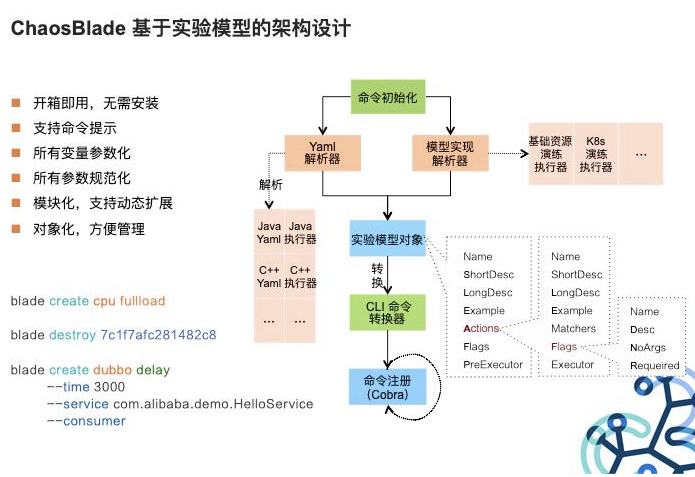
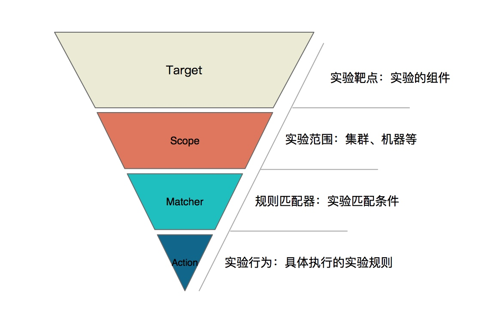
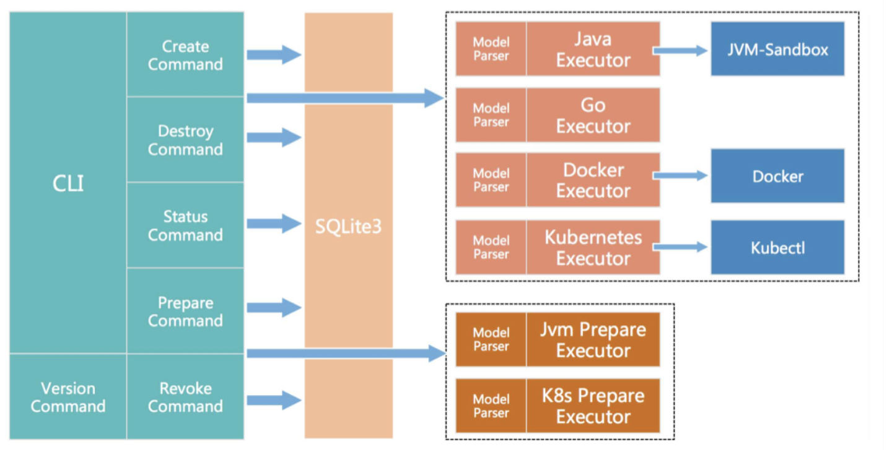

---
tags:
  - 实战
  - ChaosBlade
  - 混沌工程
---


# Chaos Blade 实战

> 摘要：Chaos Blade 是阿里巴巴开源的混沌工程工具，建立在近十年故障测试和演练实践基础上。本文整理 Chaos Blade 的部署方式、混沌实验模型、典型场景以及常用命令，帮助在主机、容器和 Kubernetes 环境中进行故障注入。

## 一、什么是 Chaos Blade

Chaos Blade 是阿里巴巴内部 MonkeyKing 对外开源的项目，结合了集团各业务的最佳实践。它不仅使用简单，而且支持丰富的实验场景，覆盖基础资源、Java 应用、C++ 应用、Docker 容器和云原生平台。

与 Chaos Mesh 相比：

| 维度 | Chaos Blade | Chaos Mesh |
|---|---|---|
| 运行环境 | 主机、容器、Kubernetes | 主要面向 Kubernetes |
| 使用方式 | CLI 命令、YAML | CRD + Dashboard |
| 场景丰富度 | 极高，支持 JVM、数据库、缓存、微服务 | 丰富，面向 K8s 原生资源 |
| 侵入性 | 应用无侵入，扩展性强 | 应用无侵入，sidecar 设计 |
| 适用场景 | 混合环境、应用层精细控制 | K8s 环境、可视化编排 |

## 二、部署方式

### 2.1 容器内快速体验

```bash
docker pull chaosbladeio/chaosblade-demo
docker run -it --privileged chaosbladeio/chaosblade-demo
```

### 2.2 二进制包安装

下载对应平台的 release 包（支持 linux/amd64 和 darwin/amd64）：

```bash
# 从 GitHub Releases 下载
wget https://github.com/chaosblade-io/chaosblade/releases/download/v1.7.0/chaosblade-1.7.0-linux-amd64.tar.gz

# 解压
tar -zxvf chaosblade-1.7.0-linux-amd64.tar.gz
cd chaosblade-1.7.0

# blade 即为客户端工具
./blade version
```

## 三、架构设计

Chaos Blade 的整体架构分为以下层次：

```text
┌─────────────────────────────────────┐
│           CLI / YAML                │
│  用户通过 blade 命令或 K8s YAML 触发   │
└─────────────┬───────────────────────┘
              │
┌─────────────▼───────────────────────┐
│      Chaos Blade Operator           │
│  负责解析实验定义，下发执行指令         │
└─────────────┬───────────────────────┘
              │
┌─────────────▼───────────────────────┐
│      Experiment Executor            │
│  在目标主机、容器或 Pod 中执行具体故障   │
└─────────────────────────────────────┘
```



核心设计目标：

- **统一实验模型**：所有场景都遵循 Target-Scope-Matcher-Action 模型。
- **多平台支持**：同一套工具覆盖主机、容器、K8s。
- **无侵入**：对目标应用无代码侵入。

## 四、混沌实验模型

Chaos Blade 的所有实验场景都遵循统一的四层实验模型：

| 层级 | 含义 | 示例 |
|---|---|---|
| **Target** | 实验靶点，即发生故障的组件 | 容器、CPU、磁盘、Dubbo、Redis |
| **Scope** | 实验实施范围 | 具体机器、集群、Namespace |
| **Matcher** | 实验规则匹配器 | 服务名、方法名、操作类型 |
| **Action** | 模拟的具体场景 | 延迟、异常、返回指定值、参数篡改 |

示例映射：

```text
Target: cpu
Scope: node
Matcher: names=["node-1"]
Action: fullload
```

表示：在 node-1 节点上触发 CPU 满载。



## 五、功能支持

Chaos Blade 支持以下实验场景：

### 5.1 基础资源

- CPU：满载、指定百分比负载
- 内存：占用、溢出
- 网络：延迟、丢包、分区、乱序
- 磁盘：磁盘满、I/O 高负载
- 进程：杀进程、挂起

### 5.2 Java 应用

- 数据库：连接异常、SQL 延迟
- 缓存：Redis 操作延迟、异常
- 消息：消息队列延迟、消息丢失
- JVM：Full GC、方法延迟、返回值篡改
- 微服务：Dubbo 调用延迟、异常

### 5.3 C++ 应用

- 指定方法或某行代码注入延迟
- 变量和返回值篡改

### 5.4 Docker 容器

- 杀容器
- 容器内 CPU、内存、网络、磁盘、进程故障

### 5.5 云原生平台（Kubernetes）

- 节点：CPU、内存、网络、磁盘、进程故障
- Pod：网络故障、杀 Pod
- 容器：同 Docker 容器场景

## 六、实战案例

### 6.1 主机 CPU 满载

```bash
# 将本地 CPU 负载提升到 80%，持续 60 秒
blade create cpu fullload --cpu-percent 80 --timeout 60
```

### 6.2 主机网络延迟

```bash
# 对访问目标 IP 的流量注入 100ms 延迟
blade create network delay --time 100 --offset 10 --interface eth0 --destination-ip 192.168.1.1 --timeout 60
```

### 6.3 Java 方法延迟

```bash
# 对指定类方法注入 3000ms 延迟
blade create jvm delay --time 3000 --classname com.example.OrderService --methodname createOrder --pid 12345
```

### 6.4 杀容器

```bash
# 停止指定容器 60 秒
blade create docker stop --container-id abc123 --timeout 60
```

### 6.5 Kubernetes 节点 CPU 满载

```yaml
apiVersion: chaosblade.io/v1alpha1
kind: ChaosBlade
metadata:
  name: cpu-load
spec:
  experiments:
  - scope: node
    target: cpu
    action: fullload
    desc: "increase node cpu load by names"
    matchers:
    - name: names
      value:
      - "node-1"
    - name: cpu-percent
      value:
      - "80"
```

执行：

```bash
kubectl apply -f cpu-load.yaml
```

## 七、常用 blade 命令

| 命令 | 作用 |
|---|---|
| `blade create` | 创建一个混沌实验 |
| `blade destroy` | 销毁一个混沌实验 |
| `blade prepare` | 准备混沌实验环境，部分实验执行前必须执行 |
| `blade revoke` | 撤销混沌实验环境，与 prepare 对应 |
| `blade status` | 查询混沌实验和环境状态 |
| `blade query` | 查询部分实验所需的系统参数 |
| `blade version` | 打印 blade 工具版本信息 |
| `blade server` | 以 server 模式运行 |



### 7.1 查看实验状态

```bash
blade status --type create
```

### 7.2 销毁实验

```bash
blade destroy <UID>
```

### 7.3 查询支持的实验场景

```bash
blade create --help
blade create cpu --help
blade create jvm --help
```

## 八、面向 Kubernetes 的使用方式

Chaos Blade 在 Kubernetes 中的使用方式有两种：

1. **YAML 配置方式**：使用 kubectl 执行。
2. **blade 命令方式**：直接在已安装 blade 的节点上执行。

推荐在 K8s 环境中使用 YAML 方式，便于版本管理和复现。

## 九、项目级 Checklist

- [ ] 已明确实验目标、稳态指标和成功假设。
- [ ] 已选择正确的 Target、Scope、Matcher、Action。
- [ ] 已在测试环境验证 blade 命令或 YAML 配置。
- [ ] Java 应用实验前已执行 `blade prepare jvm`。
- [ ] 实验影响范围已控制，关键生产实验有值守人员。
- [ ] 已配置监控和告警，观察实验期间指标变化。
- [ ] 实验结束后已执行 `blade destroy` 或删除 YAML 资源。
- [ ] 实验结果已归档，并转化为系统改进项。

## 参考资源

- [Chaos Blade 官方文档](https://chaosblade.io/)
- [Chaos Blade GitHub](https://github.com/chaosblade-io/chaosblade)
- [Chaos Blade README 中文](https://github.com/chaosblade-io/chaosblade/blob/master/README_CN.md)
- [Awesome Chaos Engineering](https://github.com/chaosops/awesome-chaos-engineering)