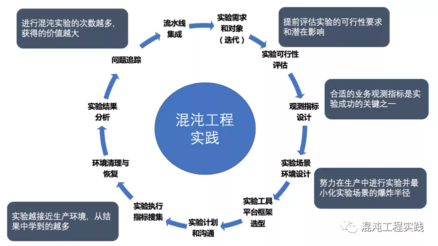
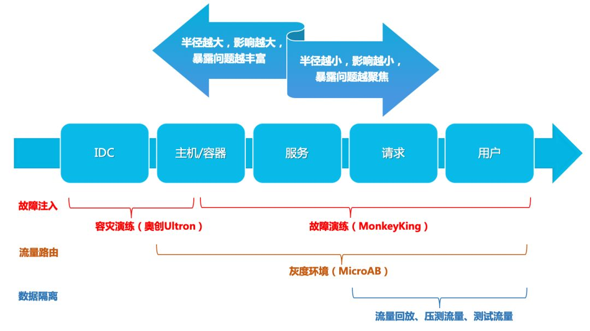

---
tags:
  - "#理论"
  - "#混沌工程"
  - "#稳定性测试"
---

# 5.3.1 混沌工程理论与原则

> 摘要：混沌工程是在分布式系统上进行受控实验的学科，通过主动注入故障来验证系统韧性。本文整理混沌工程的核心概念、实验流程、重要原则，以及常见工具选型参考。

## 一、什么是混沌工程

混沌工程（Chaos Engineering）是在分布式系统上进行实验的学科，目的是建立对系统抵御生产环境中失控条件的能力以及信心。

它不同于传统的故障演练或容灾测试：

- **传统测试**：验证系统是否符合已知需求，关注「能不能用」。
- **混沌工程**：通过在生产环境注入真实故障，揭示系统未知的弱点，关注「坏了还能不能用」。

## 二、为什么需要混沌工程

### 2.1 分布式系统的复杂性挑战

- **服务依赖挑战**：微服务架构下服务间调用链路复杂，单点故障可能引发级联失效。
- **环境动态性**：云原生环境中的弹性伸缩、自动扩缩容与回滚增加了不确定性。
- **传统测试局限**：单元测试/集成测试难以覆盖真实生产环境中的复杂故障场景。

### 2.2 业务稳定性需求

- **金融级 SLA 要求**：99.999% 可用性目标需要验证极端场景下的系统表现。
- **故障恢复能力验证**：验证熔断、降级、重试等容错机制的有效性。

总之，云原生的发展不断推进着微服务的进一步解耦，海量的数据与用户规模也带来了基础设施的大规模分布式演进。分布式系统天生有着各种相互依赖，可以出错的地方数不胜数，处理不好就会导致业务受损，或者其他各种无法预期的异常行为。

## 三、混沌工程的核心原理

混沌工程的核心特征是**对照观测实验**。为了揭示系统弱点，混沌工程实验通常遵循以下步骤：

```text
1. 定义稳态  →  2. 构建假设  →  3. 故障注入  →  4. 监控观察  →  5. 系统改进
```



### 3.1 定义稳态

通过可量化的指标（响应时间、错误率、吞吐量等）定义系统正常运行的表现，为后续测试的有效性提供基准。

示例指标：

- P99 响应时间 < 200ms
- 错误率 < 0.1%
- 订单支付成功率 = 100%

### 3.2 构建假设

提出系统对故障的预期反应，确保实验过程中有明确的衡量标准。

示例假设：

> 当订单服务某个 Pod 被杀死时，服务应在 30 秒内自动恢复，且支付成功率保持不变。

### 3.3 故障注入

在实验组中主动注入特定故障，模拟生产环境中可能遇到的真实问题。常见故障类型：

- 节点故障：Pod 被杀、容器崩溃、节点宕机
- 网络故障：延迟、丢包、分区、DNS 异常
- 资源故障：CPU 满载、内存耗尽、磁盘 I/O 异常
- 应用故障：JVM 方法延迟、返回值篡改、数据库连接异常

### 3.4 监控和观察

监控系统指标变化及恢复时间，对比实验组与对照组的数据差异，评估是否符合实验假设。

关键观察点：

- 故障注入后，稳态指标是否偏移
- 系统是否触发熔断、降级、重试
- 恢复时间是否在预期范围内
- 是否产生级联影响

### 3.5 系统改进

根据实验结果，优化系统的故障处理机制，提升其可靠性。

破坏稳态的难度越大，我们对系统行为的信心就越强。如果发现了一个弱点，那么我们就有了一个改进目标，避免在系统规模化之后被放大。

## 四、混沌工程的重要原则

### 4.1 在生产环境中运行实验

系统的行为因环境和流量模式而异。由于利用率的行为随时可能发生变化，对真实流量进行采样是可靠捕获请求路径的唯一方法。

为了保证系统运行方式的真实性以及与当前部署系统的相关性，混沌工程强烈倾向于直接在生产流量上进行试验。

### 4.2 自动化实验以连续运行

手动运行实验是劳动密集型的，最终是不可持续的。混沌工程将自动化构建到系统中，以驱动编排和分析。

实践建议：

- 将混沌实验纳入 CI/CD 或定时任务
- 实验结果自动归档，生成趋势报告
- 失败时自动告警或回滚

### 4.3 最小化爆炸半径

混沌工程具备导致生产环境崩溃的风险，所谓「最小化爆炸半径」就是尽量让薄弱环节暴露出来，又不会造成更大规模的故障。

分阶段实验策略：

1. 单服务实例故障
2. 单集群故障
3. 跨区域故障

具体实践：

- 采用递进的方式进行实验
- 只向一小部分终端用户注入故障
- 开始进行小规模的扩散实验
- 小规模集中实验，不断扩大实验范围
- 在实验造成过多危害时，自动终止实验
- 避免在高风险时段进行实验
- 每次只检验一个可控故障



## 五、混沌实验设计模板

```markdown
# 混沌实验设计

## 实验目标
验证 xxx 服务在 yyy 故障场景下的可用性。

## 稳态定义
- P99 延迟 < 200ms
- 错误率 < 0.1%

## 假设
当注入 zzz 故障时，系统应在 30s 内自动恢复，且稳态指标不受影响。

## 故障类型
Pod 故障 / 网络延迟 / CPU 满载 / ...

## 影响范围
- Namespace: xxx
- Label Selector: app=xxx
- 实验持续时间: 60s

## 观察指标
- 应用 QPS / 错误率 / P99 延迟
- 下游服务调用情况
- 告警触发情况

## 回滚/止损方案
- 手动停止实验
- 自动扩容
- 切换备用集群

## 实验结论
- 假设是否成立
- 发现的弱点
- 后续改进项
```

## 六、工具选型参考

| 维度 | Chaos Monkey | Chaos Mesh | Chaos Blade |
|---|---|---|---|
| 安装依赖 | Spinnaker | 无 | 无 |
| 部署方式 | Spinnaker 上配置启用 | Helm、脚本部署 | 二进制包、容器直接运行 |
| 功能特点 | 场景单一，仅支持终止实例 | 场景丰富，支持云原生，应用无侵入 | 场景极其丰富，支持主机/容器/JVM，扩展性强 |
| 易用性 | 上手较困难 | 提供 Dashboard 和 Grafana 插件 | CLI 方式执行，命令提示友好 |
| 社区活跃度 | release 周期长，国内资料少 | 活跃度高 | 活跃度高，国内实践案例多 |
| 适用场景 | 传统 EC2 环境 | Kubernetes 环境 | 主机、容器、K8s、JVM 应用 |

选型建议：

- **Kubernetes 环境**：优先 Chaos Mesh，可视化程度高，与 K8s 生态融合好。
- **混合环境/主机+容器**：优先 Chaos Blade，CLI 简洁，场景覆盖广。
- **云上虚拟机**：可考虑 Chaos Monkey 或云平台自带故障注入服务。

## 七、项目级 Checklist

- [ ] 实验前明确稳态指标和成功假设。
- [ ] 实验影响范围已评估，爆炸半径可控。
- [ ] 已配置监控、日志、告警，能够实时观察实验效果。
- [ ] 已制定回滚/止损方案，关键实验有人员值守。
- [ ] 优先在测试环境验证实验，再谨慎推向生产。
- [ ] 实验已自动化，可定时或持续运行。
- [ ] 实验结果已归档，形成可复用的实验库。
- [ ] 发现的弱点已转化为具体的改进项并跟踪。

## 参考资源

- [Chaos Engineering Book](https://www.oreilly.com/library/view/chaos-engineering/9781491983879/)
- [Chaos Mesh 官方文档](https://chaos-mesh.org/)
- [Chaos Blade 官方文档](https://chaosblade.io/)
- [Awesome Chaos Engineering](https://github.com/chaosops/awesome-chaos-engineering)
- [InfoQ 混沌工程实践](https://www.infoq.cn/article/xbbm7mft8lecbzqh2bnw)
