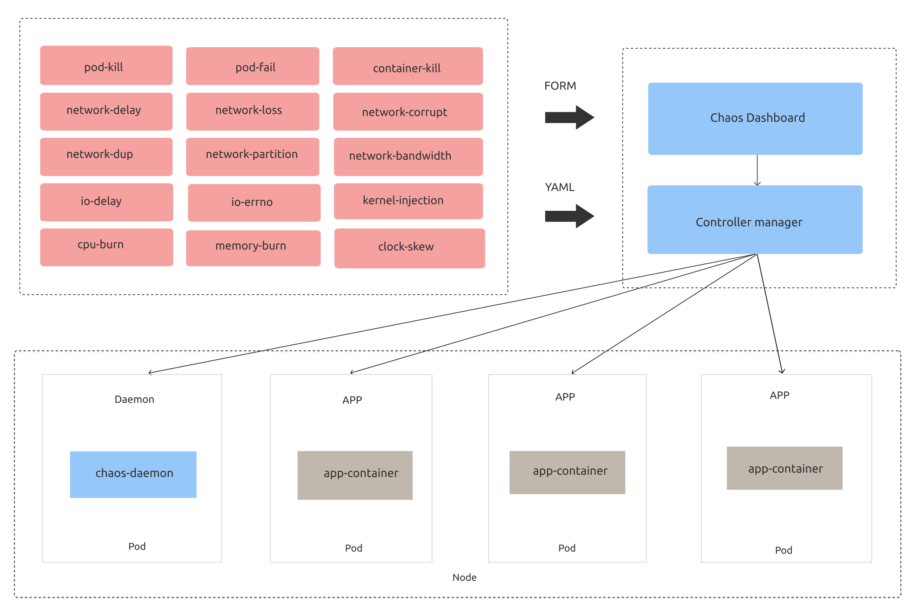
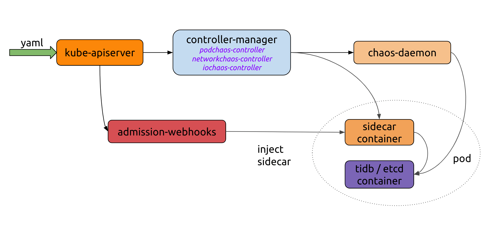
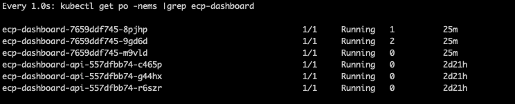
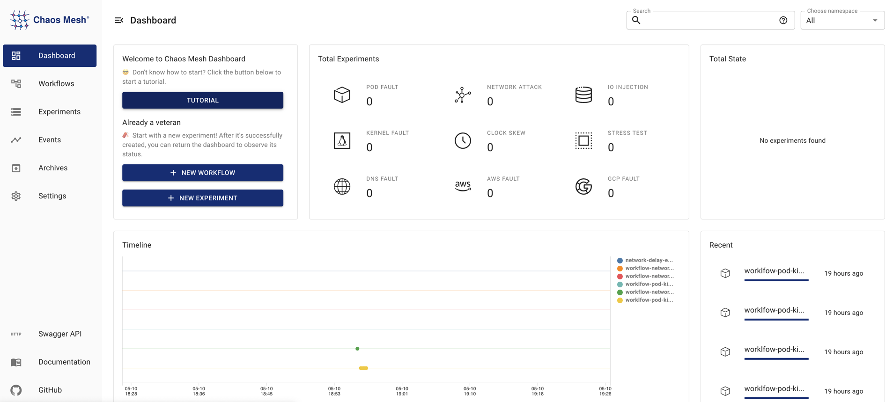
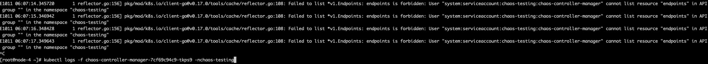

---
tags:
  - "#实战"
  - "#混沌工程"
  - "#ChaosMesh"
  - "#Kubernetes"
---


# Chaos Mesh 实战

> 摘要：Chaos Mesh 是 PingCap 开源的云原生混沌测试平台，提供在 Kubernetes 平台上进行混沌实验的能力。本文整理 Chaos Mesh 的架构设计、安装部署、核心 CRD、典型故障注入场景以及实战排障经验。

## 一、什么是 Chaos Mesh

Chaos Mesh 是一个云原生的混沌测试平台，2019 年 12 月 31 日由 PingCap 在 GitHub 上正式开源。它通过运行在 K8s 集群中的「特权」容器，依据 CRD 资源中的测试场景，在集群中制造混沌（模拟故障）。

核心特点：

- **云原生**：深度集成 Kubernetes，通过 CRD 定义实验。
- **场景丰富**：支持 Pod、网络、DNS、HTTP、压力、I/O、时间、内核等多种故障类型。
- **可视化**：提供 Chaos Dashboard，可通过 Web UI 管理和监控实验。
- **可编排**：支持串行/并行实验编排、状态检查、中途暂停。

## 二、架构设计

Chaos Mesh 的整体架构由以下核心组件组成：

```text
┌─────────────────┐
│  Chaos Dashboard │  Web UI，用于管理、设计、监控混沌实验
└────────┬────────┘
         │
┌────────▼────────┐
│ Controller-manager│  调度和管理 CRD 对象的生命周期
│                   │  包含 controllers 和 admission-webhooks
└────────┬────────┘
         │
┌────────▼────────┐
│   Chaos-daemon  │  以 DaemonSet 运行，具有 Privileged 权限
│                 │  可操作节点上的网络设备、Cgroup 等
└─────────────────┘
```



### 2.1 核心组件

| 组件 | 职责 |
|---|---|
| **Chaos Dashboard** | Web UI，用于管理、设计、监控混沌实验 |
| **Controller-manager** | 调度 CRD 对象，管理实验生命周期 |
| **Chaos-daemon** | 以 DaemonSet 运行在节点上，执行具体的错误注入 |
| **Admission-webhooks** | 动态给目标 Pod 注入 sidecar 容器 |

### 2.2 工作流

1. 用户通过 YAML 或 Kubernetes 客户端创建/更新 Chaos 对象。
2. Controller-manager 通过 watch API Server 感知事件，维护实验生命周期。
3. Chaos-daemon 和 sidecar 容器协同工作，提供错误注入能力。
4. Admission-webhooks 在 Pod 创建时动态注入 sidecar 容器。



## 三、CRD 设计

Chaos Mesh 使用 Kubernetes CRD 来定义 chaos 对象。这种设计可以：

- 避免重复造轮子，融入 Kubernetes 生态。
- 将不同错误注入类型的定义和逻辑实现从最顶层抽离。
- 通过 controller-runtime 提供的封装，避免为每个 CRD 单独实现 controller。

目前 Chaos Mesh 中常见的 CRD 对象：

| CRD | 故障类型 |
|---|---|
| PodChaos | Pod 故障：Pod 重启、Pod 不可用、容器故障 |
| NetworkChaos | 网络故障：延迟、丢包、乱序、分区 |
| DNSChaos | DNS 故障：解析失败、返回错误 IP |
| HTTPChaos | HTTP 通信故障：延迟、中断 |
| StressChaos | 压力场景：CPU/内存抢占 |
| IOChaos | 文件 I/O 故障：延迟、读写失败 |
| TimeChaos | 时间跳动异常 |
| KernelChaos | 内核故障 |
| JVMChaos | JVM 应用故障 |

## 四、安装部署

### 4.1 脚本安装

```bash
wget -O /tmp/install.sh https://mirrors.chaos-mesh.org/latest/install.sh
sh /tmp/install.sh -r containerd
```

### 4.2 Helm 安装

```bash
git clone https://github.com/pingcap/chaos-mesh.git
cd chaos-mesh

# 创建 CRD 资源
kubectl apply -f manifests/

# 安装 Chaos Mesh
helm install helm/chaos-mesh --name=chaos-mesh --namespace=chaos-testing

# 检查状态
kubectl get pods --namespace chaos-testing -l app.kubernetes.io/instance=chaos-mesh
```

### 4.3 ARM 环境镜像

Docker Hub 上只有 Chaos Mesh 每个 Release 版本的 X86 镜像，ARM 环境需要指定 `ghcr.io` 镜像：

```bash
kubectl set image deploy chaos-controller-manager \
  chaos-mesh=ghcr.io/chaos-mesh/chaos-mesh/chaos-mesh:latest-arm64 -n chaos-testing

kubectl set image deploy chaos-dashboard \
  chaos-dashboard=ghcr.io/chaos-mesh/chaos-mesh/chaos-dashboard:latest-arm64 -n chaos-testing

kubectl set image ds chaos-daemon \
  chaos-daemon=ghcr.io/chaos-mesh/chaos-mesh/chaos-daemon:latest-arm64 -n chaos-testing
```

## 五、实战案例

### 5.1 模拟 Pod 故障

PodChaos 支持三种故障类型：

- **Pod Failure**：Pod 在一段时间内不可用。
- **Pod Kill**：杀死指定 Pod，需配合 ReplicaSet/Deployment 自动重启。
- **Container Kill**：杀死目标 Pod 中的指定容器。

#### Pod Failure 示例

```yaml
apiVersion: chaos-mesh.org/v1alpha1
kind: PodChaos
metadata:
  name: pod-failure-example
  namespace: chaos-testing
spec:
  action: pod-failure
  mode: one
  duration: '30s'
  selector:
    namespaces:
      - demo
    labelSelectors:
      'app': 'order-service'
```

#### Pod Kill 示例

```yaml
apiVersion: chaos-mesh.org/v1alpha1
kind: PodChaos
metadata:
  name: pod-kill-example
  namespace: chaos-testing
spec:
  action: pod-kill
  mode: all
  selector:
    namespaces:
      - demo
    labelSelectors:
      'app': 'order-service'
```

实验执行后，目标 Pod 会被杀死并重新创建：



#### Container Kill 示例

```yaml
apiVersion: chaos-mesh.org/v1alpha1
kind: PodChaos
metadata:
  name: container-kill-example
  namespace: chaos-testing
spec:
  action: container-kill
  mode: all
  duration: '60s'
  containerNames: ['order-container']
  selector:
    namespaces:
      - demo
    labelSelectors:
      'app': 'order-service'
```

#### PodChaos 字段说明

| 参数 | 类型 | 说明 | 必填 |
|---|---|---|---|
| action | string | pod-failure / pod-kill / container-kill | 是 |
| mode | string | one / all / fixed / fixed-percent / random-max-percent | 是 |
| value | string | mode 对应的参数，如百分比 | 否 |
| selector | struct | 目标 Pod 选择器 | 是 |
| containerNames | []string | container-kill 时必填 | 否 |
| gracePeriod | int64 | pod-kill 时删除 Pod 前的持续时间 | 否 |
| duration | string | 实验持续时间 | 是 |

### 5.2 模拟压力场景

StressChaos 通过 `stress-ng` 在选中容器内创建 worker 进程，模拟 CPU 或内存压力。

```yaml
apiVersion: chaos-mesh.org/v1alpha1
kind: StressChaos
metadata:
  name: stress-example
  namespace: chaos-testing
spec:
  mode: all
  duration: '60s'
  selector:
    namespaces:
      - demo
    labelSelectors:
      'app': 'order-service'
  stressors:
    memory:
      workers: 2
      size: '1024MB'
    cpu:
      workers: 2
      load: 100
```

### 5.3 模拟文件 I/O 故障

IOChaos 支持以下故障类型：

- **latency**：为文件系统调用加入延迟
- **fault**：使文件系统调用返回错误
- **attrOverride**：修改文件属性
- **mistake**：使文件读到或写入错误的值

注意事项：

- 创建 IOChaos 前，确保目标 Pod 上没有运行 Chaos Mesh 的 Controller Manager。
- IOChaos 可能会损坏数据，在生产环境中请谨慎使用。

```yaml
apiVersion: chaos-mesh.org/v1alpha1
kind: IOChaos
metadata:
  name: io-latency-example
  namespace: chaos-testing
spec:
  action: latency
  mode: one
  selector:
    namespaces:
      - demo
    labelSelectors:
      app: order-service
  volumePath: /var/log/app
  path: '/var/log/app/**/*'
  delay: '1000ms'
  percent: 50
  duration: '400s'
```

## 六、Schedule 定时实验

Chaos Mesh 支持通过 Schedule 资源定时执行混沌实验，适合持续演练场景。

### 6.1 每隔 30 分钟随机 kill 符合条件的 Pod

```yaml
apiVersion: chaos-mesh.org/v1alpha1
kind: Schedule
metadata:
  name: random-pod-kill
  namespace: chaos-testing
spec:
  schedule: '*/30 * * * *'
  concurrencyPolicy: Forbid
  historyLimit: 10
  type: PodChaos
  podChaos:
    action: pod-kill
    gracePeriod: 0
    mode: one
    selector:
      namespaces:
        - demo
      labelSelectors:
        app: order-service
```

### 6.2 每隔 10 分钟注入网络延迟

```yaml
apiVersion: chaos-mesh.org/v1alpha1
kind: Schedule
metadata:
  name: network-delay
  namespace: chaos-testing
spec:
  schedule: '*/10 * * * *'
  concurrencyPolicy: Forbid
  historyLimit: 10
  type: NetworkChaos
  networkChaos:
    selector:
      namespaces:
        - demo
      labelSelectors:
        app: order-service
    mode: one
    action: delay
    duration: 120s
    delay:
      latency: 1s
      correlation: '100'
      jitter: '0ms'
```

## 七、可视化界面与 RBAC

### 7.1 Chaos Dashboard

Chaos Dashboard 极大地简化了混沌实验：

- 通过可视化界面管理实验范围。
- 指定故障注入类型和调度规则。
- 在界面上获取实验结果。



### 7.2 权限控制

Chaos Mesh 通过 Kubernetes 原生 RBAC 管理权限：

- 创建 Role 并绑定到 Service Account。
- 生成 Service Account 对应的 Token。
- 用户使用 Token 登录 Dashboard，只能在授权范围内进行实验。

此外，还可以通过 Namespace Annotation 开启特定 Namespace 下的实验权限。

## 八、常见问题与排障

### 8.1 没有 list ep 的权限

现象：Controller Manager 报 RBAC 权限错误。



解决：手动部署 RoleBinding。

```yaml
apiVersion: rbac.authorization.k8s.io/v1
kind: RoleBinding
metadata:
  name: chaos-mesh-chaos-controller-manager-control-plane
  namespace: chaos-testing
roleRef:
  apiGroup: rbac.authorization.k8s.io
  kind: Role
  name: chaos-mesh-chaos-controller-manager-control-plane
subjects:
- kind: ServiceAccount
  name: chaos-controller-manager
  namespace: chaos-testing
```

### 8.2 Chaos Pod 没有创建出来

现象：受 PodSecurityPolicy 限制，Chaos Pod 无法创建。

解决：手动部署 PSP 相关的 RoleBinding。

```yaml
apiVersion: rbac.authorization.k8s.io/v1
kind: RoleBinding
metadata:
  name: psp-chaos-testing
  namespace: chaos-testing
roleRef:
  apiGroup: rbac.authorization.k8s.io
  kind: ClusterRole
  name: psp-privileged
subjects:
- apiGroup: rbac.authorization.k8s.io
  kind: Group
  name: system:serviceaccounts:chaos-testing
```

### 8.3 ARM 环境编译镜像

需求：ARM 机器需要自行编译 Chaos Mesh 镜像。

前置条件：

- Docker 20+（支持 `--load` 参数）
- 安装 Golang

```bash
git clone https://github.com/chaos-mesh/chaos-mesh.git
cd chaos-mesh && UI=1 make chaos-dashboard
```

常见问题：

- `--platform` 错误：启用 Docker experimental features。
- `TLSHandshakeTimeout`：在 Makefile 中增加 `docker run` 主机网络参数。

## 九、项目级 Checklist

- [ ] 已明确实验目标、稳态指标和成功假设。
- [ ] 已评估实验影响范围，控制爆炸半径。
- [ ] 已在测试环境验证 YAML 配置，再推向生产。
- [ ] 已配置监控和告警，能实时观察实验效果。
- [ ] 已制定回滚/止损方案。
- [ ] 已配置 RBAC，限制实验操作权限。
- [ ] Schedule 实验已设置合理的并发策略和历史限制。
- [ ] 实验结果已归档，并转化为系统改进项。

## 参考资源

- [Chaos Mesh 官方文档](https://chaos-mesh.org/)
- [Chaos Mesh GitHub](https://github.com/chaos-mesh/chaos-mesh)
- [Chaos Mesh Workflow](https://chaos-mesh.org/zh/docs/create-chaos-mesh-workflow/)
- [定义实验范围](https://chaos-mesh.org/zh/docs/define-chaos-experiment-scope/)