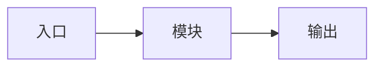

# {{title}}

> **摘要**：一句话说明本方案要解决什么问题、预期带来什么收益。

## 一、背景与问题

<!-- 描述现状、痛点、触发本方案的原因 -->

- 现状：...
- 痛点：...
- 触发原因：...

## 二、目标与范围

### 2.1 目标

<!-- SMART 目标，可量化最好 -->

1. 
2. 
3. 

### 2.2 范围

- **包含**：...
- **不包含**：...

## 三、方案选型

<!-- 列出至少两个候选方案，从成本、风险、可维护性等维度对比 -->

| 维度 | 方案 A | 方案 B | 方案 C |
| ---- | ------ | ------ | ------ |
| 实现成本 | | | |
| 运维成本 | | | |
| 性能影响 | | | |
| 回滚难度 | | | |
| 长期可维护性 | | | |

**最终选择**：方案 X，理由：...

## 四、详细设计

### 4.1 架构图 / 流程图

<!-- 可插入图片或 Mermaid 代码 -->

### 4.2 核心模块说明

#### 模块 1：xxx

- 职责：...
- 关键接口/配置：...
- 异常处理：...

#### 模块 2：xxx

- 职责：...
- 关键接口/配置：...
- 异常处理：...

### 4.3 数据模型 / 接口变更

| 字段/接口 | 类型 | 说明 |
| --------- | ---- | ---- |
| | | |

## 五、风险与回滚

| 风险 | 概率 | 影响 | 应对策略 | 回滚方案 |
| ---- | ---- | ---- | -------- | -------- |
| | | | | |

## 六、实施计划

- [ ] 第一步：...
- [ ] 第二步：...
- [ ] 第三步：...

## 七、验收标准

- [ ] 功能验收：...
- [ ] 性能验收：...
- [ ] 监控验收：...

## 八、关联文档

- 相关背景调研（待补充）
- 相关技术知识点（待补充）
- 相关项目实战（待补充）

---

> **更新记录**
> - {{date}}：创建方案
